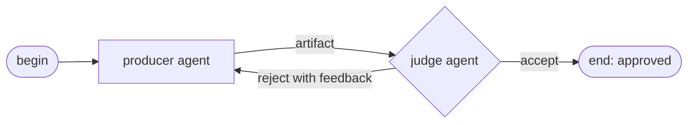
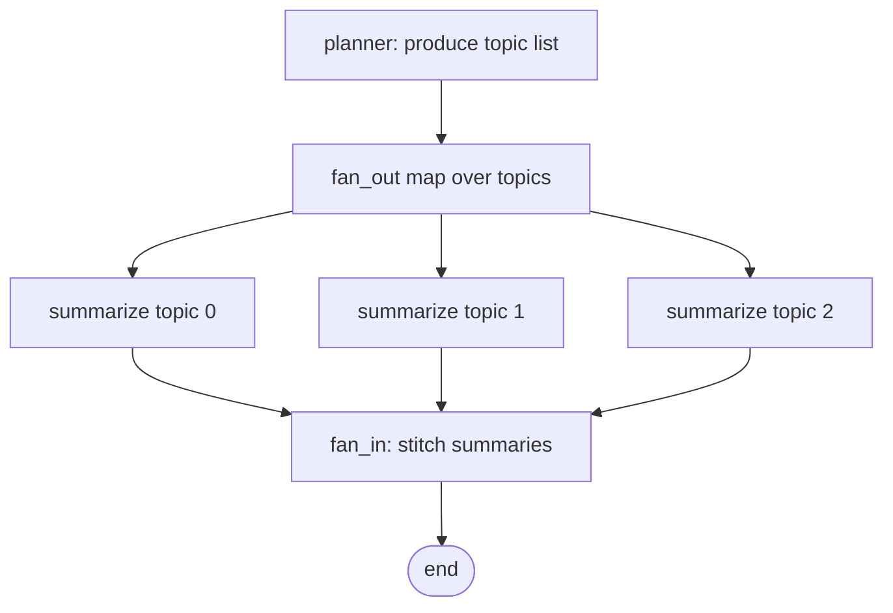

# 6. Graphs

> Part of the [Microagents Thesis](README.md) series. Previous:
> [Workspaces](05-workspaces.md). Next:
> [Event-driven execution](07-event-driven-execution.md).

## Sequencing, not just sharing

Workspaces let agents share state. They do not sequence agents, and sequencing is what
the thesis actually requires. Which agent runs first, what triggers the next one, when a
loop stops: these need an explicit structure. That structure is the graph.

A Primer graph is a directed graph of agent nodes. Crucially it is allowed to be
*cyclic*: edges can point back, so the flow can loop. A single field, `max_iterations`,
bounds the loop so a cycle cannot run forever. That one allowance unlocks a whole family
of multi-agent interaction patterns:

- **Producer/consumer**: one node generates work, another processes it.
- **Map-reduce**: fan a task out across many parallel nodes, then fan the results back in
  to a single node that combines them.
- **Feedback loop**: two nodes pass control back and forth until a condition is met.

The Pregel-style executor that runs these graphs, the full node and edge model, and the
validation rules are documented in [graphs](../subsystems/graphs.md).

## The node and edge vocabulary

A graph is `nodes` plus `edges` plus `max_iterations`. Node kinds:

| Node kind | Role |
| --- | --- |
| `begin` | Single entry point; may declare an `input_schema` |
| `end` | Terminal; renders an `output_template`. A graph may have several |
| `agent` | Runs one agent on a templated `input_template`; may set `response_format` |
| `graph` | Runs a sub-graph |
| `fan_out` | Spawns parallel instances of a target node |
| `fan_in` | Aggregates the outputs of a fanned-out node |
| `tool_call` | Calls a tool directly, with templated `arguments` |

Edges are either `static` (`from_node` to `to_node`) or `conditional` (a `router` picks
the next node from the producing node's output). Inputs flow between nodes through Jinja2
templates that can read `nodes.<id>.text`, `nodes.<id>.parsed` (when a node set a
`response_format`), the `iteration` counter, and, inside fan-out targets, `fanout_index`
and `fanout_item`.

## The adversarial feedback loop

The feedback loop is the case the thesis most wanted to test, because it is the classic
way to lift quality out of imperfect components. Pair two adversarial agents. One is a
**producer** that generates an artifact. The other is a **judge** that evaluates it and
either accepts it or sends it back with specific feedback. The producer revises, the
judge re-evaluates, and the cycle repeats until the judge is satisfied or the iteration
budget runs out.



Here is the complete graph that expresses it, using the real schema:

```json
{
  "id": "g-feedback-loop",
  "description": "Producer-Judge feedback loop: producer writes, judge accepts or rejects.",
  "max_iterations": 5,
  "nodes": [
    { "kind": "begin", "id": "start" },
    {
      "kind": "agent",
      "id": "producer",
      "agent_id": "ag-writer",
      "input_template": "Write the release notes for this PR.Revise using this feedback: {{ nodes.judge.parsed.feedback }}"
    },
    {
      "kind": "agent",
      "id": "judge",
      "agent_id": "ag-critic",
      "input_template": "Review these notes:\n{{ nodes.producer.text }}\n\nReturn JSON {\"status\": \"accept\"|\"reject\", \"feedback\": \"...\"}.",
      "response_format": {
        "type": "object",
        "properties": {
          "status": { "type": "string", "enum": ["accept", "reject"] },
          "feedback": { "type": "string" }
        },
        "required": ["status", "feedback"]
      }
    },
    { "kind": "end", "id": "approved", "output_template": "{{ nodes.producer.text }}" }
  ],
  "edges": [
    { "kind": "static", "from_node": "start", "to_node": "producer" },
    { "kind": "static", "from_node": "producer", "to_node": "judge" },
    {
      "kind": "conditional",
      "from_node": "judge",
      "router": {
        "kind": "json_path",
        "branches": [
          { "conditions": [ { "path": "status", "op": "eq", "value": "accept" } ], "to_node": "approved" },
          { "conditions": [ { "path": "status", "op": "eq", "value": "reject" } ], "to_node": "producer" }
        ]
      }
    }
  ]
}
```

The mechanics worth noting:

- `max_iterations: 5` is required because the graph is cyclic; it caps the rework loop.
- The judge sets a `response_format`, so its structured output is reachable as
  `nodes.judge.parsed.status` and `nodes.judge.parsed.feedback`.
- The conditional edge routes on the judge's `status`: `accept` ends the run, `reject`
  sends control back to the producer.
- The producer's `input_template` branches on `iteration`: a fresh prompt on the first
  pass, a feedback-driven revision on every later one.

Each agent in that loop is a microagent with a tight, specialized context: the producer
knows only how to produce, the judge knows only how to critique. Neither needs to be a
frontier-scale generalist. The *loop* supplies the quality that any single pass lacks,
which is precisely the bet of [chapter 1](01-constraint-and-hypothesis.md): structure and
iteration over raw single-shot capability.

## Conditional routing in detail

A conditional edge carries a `json_path` router with one or more `branches`. Each branch
has a list of `conditions` that are AND-ed together; the first branch whose conditions all
hold wins, and an optional `default_to` is the fallback. Condition operators are `eq`,
`ne`, `gt`, `gte`, `lt`, `lte`, `in`, `not_in`, and `exists`. Paths use dotted segments
with bracket indices, for example `items[2].name`. A path that does not resolve makes
every operator return false, so use `exists` to test presence rather than relying on
`ne`.

## Map-reduce: fan-out and fan-in

A `fan_out` node spawns parallel instances of a target node; a `fan_in` node aggregates
their outputs. There are three fan-out shapes:

- **broadcast**: a fixed `count` of instances of one target.
- **map**: one instance per element of a list found at `source_path` on a prior node.
- **tee**: run several named targets once each.

A map-reduce that summarizes a list of topics produced by a planner, then stitches the
summaries together:

```json
{
  "nodes": [
    { "kind": "begin", "id": "begin" },
    { "kind": "agent", "id": "planner", "agent_id": "ag-planner",
      "input_template": "List the topics to summarize as JSON {\"topics\": [...]}",
      "response_format": { "type": "object", "properties": { "topics": { "type": "array", "items": { "type": "string" } } }, "required": ["topics"] } },
    { "kind": "fan_out", "id": "fan",
      "specs": [ { "kind": "map", "target_node_id": "summarize", "source_node_id": "planner", "source_path": "topics", "on_failure": "collect" } ] },
    { "kind": "agent", "id": "summarize", "agent_id": "ag-summarizer",
      "input_template": "Summarize the topic: {{ fanout_item }}" },
    { "kind": "fan_in", "id": "stitch",
      "aggregate_template": "- {{ s.text }}\n" },
    { "kind": "end", "id": "done", "output_template": "{{ nodes.stitch.text }}" }
  ],
  "edges": [
    { "kind": "static", "from_node": "begin", "to_node": "planner" },
    { "kind": "static", "from_node": "planner", "to_node": "fan" },
    { "kind": "static", "from_node": "summarize", "to_node": "stitch" },
    { "kind": "static", "from_node": "stitch", "to_node": "done" }
  ]
}
```

The `map` spec reads `nodes.planner.parsed.topics`, spawns one `summarize` instance per
topic (each seeing its item as `fanout_item`), and the `fan_in` node walks the list
`nodes.summarize` to combine them. The `on_failure: collect` setting keeps partial results
if one instance fails rather than aborting the whole fan-out.



## Approval checkpoints in a graph

A `tool_call` node that invokes a tool requiring approval does not just run. The executor
checkpoints the graph and parks the session in a waiting state whose kind is
`tool_approval`, recording the `tool_id`, the `arguments`, and an optional rationale. A
human inspects the pending call and approves or denies it; the graph resumes or
terminates accordingly. This is the same park-and-resume machinery that powers long-running
execution, covered next in [Event-driven execution](07-event-driven-execution.md), and
the approval policies themselves are in [chapter 9](09-web-search-and-safety.md).

## The cost this introduces

Sequencing specialized agents into loops and fans has a price worth naming: the work a
frontier model might do in one expensive pass is now spread across many small passes
arranged over time. Primer has, in effect, traded computational complexity for time
complexity. Making that trade survivable is the subject of the next chapter.
