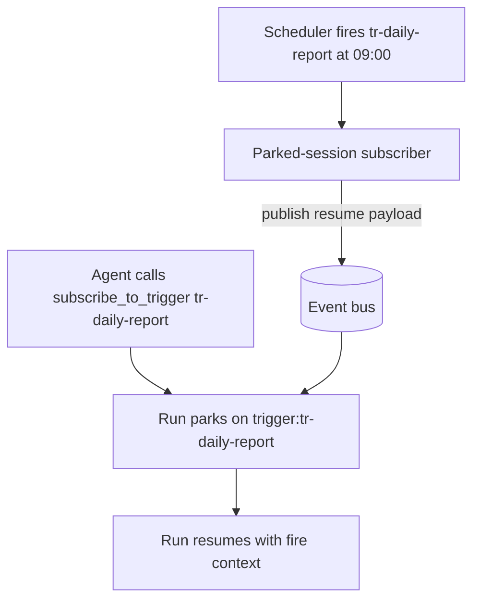

# 7. Event-driven execution

> Part of the [Microagents Thesis](README.md) series. Previous:
> [Graphs](06-graphs.md). Next: [Harnesses](08-harnesses.md).

## Compute traded for time

Sequencing specialized agents to reach frontier-quality output has a cost, and it is
worth naming plainly. The work that a frontier model might do in one expensive pass is now
spread across many small passes arranged in loops and fans. Primer has, in effect, traded
computational complexity for time complexity. A graph that grinds through a feedback loop
until the judge is happy can run for a long time.

That exposes the last structural obstacle, and it is a practical one.

## The chat-interface limit

A long-running task cannot live inside a chat window. You cannot ask a person to sit with
a chat open for minutes or hours while a graph iterates. The interaction model that works
for a quick assistant exchange is the wrong model for work the platform deliberately
stretches out over time. If a run blocks a connection while it waits, it also pins a
worker, which does not scale to many long-lived runs.

## Yielding tools and the park/resume model

The answer is to make execution event-driven rather than conversation-driven. Primer
introduces **yielding tools**: a tool an agent can call that suspends, or *parks*, the run
instead of blocking on a reply. The run does not hold a connection open and wait. It
yields, the worker is freed, and the run is resumed later when the event it is waiting for
arrives.

Mechanically, a yielding tool returns a `Yielded` sentinel with an `event_key` and
optional `timeout`. That bubbles up to the worker, which writes the run's state to the
session and flips its `parked_status` from nothing to `parked`. When the awaited event is
published to that `event_key`, a listener flips `parked_status` to `resumable`, and the
next claim cycle picks the run up and calls the tool's resume hook with the event payload.
The session row carries the park: `parked_status`, `parked_event_key`, `parked_at`, and an
opaque `parked_state` blob holding the message history and the yield metadata. The engine
that decides which worker resumes which parked run is the claim machine and worker pool,
in [claim-machine](../architecture/claim-machine.md) and
[worker-system](../architecture/worker-system.md).

```mermaid
sequenceDiagram
    participant A as Agent or graph
    participant W as Worker pool
    participant E as Event source
    A->>A: call a yielding tool
    A->>W: return Yielded with event_key, park the run
    W->>W: parked_status = parked, release the worker
    Note over A,W: no open chat, nothing blocking
    E-->>W: event published to event_key
    W->>W: parked_status = resumable
    W->>A: next claim resumes; call tool resume hook with payload
    A->>A: continue execution
```

## ask_user: waiting on a human

The first yielding tool is `ask_user`. It parks the run until a human answers, rather than
blocking. Its arguments:

- `prompt` (the question, required),
- `response_schema` (an optional JSON Schema the answer is validated against),
- `timeout_seconds` (an optional cap; falls back to the global yield ceiling).

A call looks like:

```json
{
  "type": "tool_call",
  "id": "call_ask1",
  "name": "ask_user",
  "arguments": {
    "prompt": "Ship the release notes as drafted, or hold for legal review?",
    "response_schema": { "type": "object", "properties": { "decision": { "type": "string", "enum": ["ship", "hold"] } }, "required": ["decision"] },
    "timeout_seconds": 86400
  }
}
```

The run parks on an event key like `ask_user:<session>:<tool_call>`. When the human
answers, the resume hook receives `{"response": {"decision": "ship"}}`; on timeout it
receives `{"timed_out": true, ...}`, and on cancel `{"cancelled": true, ...}`. Because the
wait is an event rather than a held connection, the answer can arrive through whatever
channel the human is actually on. The outbound and inbound bridging to Slack, Telegram,
and Discord is in [channels](../subsystems/channels.md), and the chat surface itself
reuses the very same park-and-resume machinery rather than being a special case, in
[chats](../subsystems/chats.md).

## Triggers: waiting on a schedule or an event

The second kind of wait generalizes "do this later" or "do this on a schedule" into a
first-class entity, the trigger. A trigger has a config that is either delayed (one-shot)
or scheduled (recurring).

A one-shot delayed trigger:

```json
POST /v1/triggers
{
  "slug": "remind-approval",
  "name": "Approval reminder",
  "config": { "kind": "delayed", "fire_at": "2026-06-06T14:45:30Z" }
}
```

A recurring scheduled trigger:

```json
POST /v1/triggers
{
  "slug": "daily-report",
  "name": "Daily report",
  "config": { "kind": "scheduled", "cron": "0 9 * * 1-5", "timezone": "America/New_York", "catchup": "one" }
}
```

A trigger fires; what happens when it fires is decided by its subscriptions. A
subscription binds a trigger to an action: post a chat message, start a fresh agent
session, start a fresh graph run, or wake a parked session. The fourth kind is created
automatically by the `subscribe_to_trigger` yielding tool, which lets a running agent park
itself until a named trigger fires:

```json
{
  "type": "tool_call",
  "id": "call_sub1",
  "name": "subscribe_to_trigger",
  "arguments": { "trigger_id": "tr-daily-report" }
}
```

That run parks on the event key `trigger:tr-daily-report`. When the scheduler fires the
trigger, the parked-session subscriber publishes a resume payload carrying the fire
context, the listener flips the session to resumable, and the agent continues from exactly
where it left off. The trigger entity, its subscriptions, and the scheduler that times
them are documented in [triggers](../subsystems/triggers.md).



## What this buys

With parking in place, a graph of microagents can run for hours or days. It pauses to ask
a human, sleeps until a schedule fires, or waits for an external event, and through all of
it holds no connection and pins no worker. The time complexity the thesis traded for is
now something the platform can actually sit through. The next step is making a tuned
configuration of all this portable, which is the [harness](08-harnesses.md).
