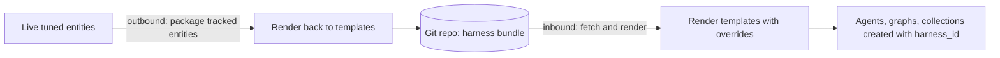

# 8. Harnesses

> Part of the [Microagents Thesis](README.md) series. Previous:
> [Event-driven execution](07-event-driven-execution.md). Next:
> [Web search and tool safety](09-web-search-and-safety.md).

## The meta-observation

By this point the platform can build, run, sequence, and patiently wait on microagents.
But there is a meta-observation hiding in the work itself. Optimizing an agent's context
for a task is *iterative*. You shape the prompt, prune the tools, tune the collection it
searches, adjust the graph it sits in, and you converge on something that works only after
several passes. That converged configuration is valuable, and it is exactly the kind of
thing people would want to share if the platform were open source.

So Primer makes the converged configuration a portable artifact: the harness.

## Helm for Primer

A harness is to Primer roughly what a Helm chart is to Kubernetes. It is a git-backed,
templated bundle of Primer entities (agents, tools, collections, graphs, and documents)
that someone can install with one step and that someone else can build and publish. Your
hard-won, context-optimized solution to a task becomes a thing you hand to another person,
who installs it and gets the same tuned behavior without redoing the iteration.

A harness on disk is a small directory:

```
release-notes-harness/
  harness.yaml            manifest: apiVersion, kind, name
  overrides.schema.json   JSON Schema for the values an installer may set
  templates/
    writer.yaml           an agent template
    critic.yaml           an agent template
    feedback-loop.yaml     a graph template
    style-kb.yaml         a collection template
```

The manifest is intentionally tiny:

```yaml
apiVersion: primer/v1
kind: Harness
name: Release Notes Harness
```

Each file under `templates/` is a Jinja2-templated entity spec. Templating uses a
sandboxed Jinja2 environment with `tojson` and `b64encode` filters, and resolves values
from `overrides` and harness metadata. An agent template parameterized on the model and a
tone override:

```yaml
kind: agent
name: writer
spec:
  description: "Drafts release notes."
  model:
    provider_id: "{{ overrides.provider_id }}"
    model_name: "{{ overrides.model_name }}"
  system_prompt:
    - "You draft release notes in a {{ overrides.tone | default('neutral') }} tone."
    - "Group changes by area. Lead with user-visible effects."
```

## How a harness is installed and built

A harness row carries the direction it operates in. The shape, in brief:

- `slug` and `name` identify it; `git_url`, `ref`, and optional `subpath` locate the
  bundle in a repository.
- `overrides` holds the values supplied at install time, validated against the bundle's
  override schema.
- `status` moves through `draft`, `ready`, `installed`, `outdated`, and `error`.
- `direction` is either `inbound` (install or sync a bundle into this platform) or
  `outbound` (package live entities and push them out).

On the **inbound** path, the harness is fetched from git, each template is rendered
against the overrides, and the resulting entities are created with harness-namespaced ids.
Entities created by a harness carry a `harness_id`, and direct CRUD on them is blocked so
the harness stays the source of truth for what it manages.

On the **outbound** path, you mark a set of live entities as tracked. Each `tracked_entity`
records its `kind`, the live `source_id`, the logical `template_name` it becomes in
`templates/`, and which fields are turned into overrides. The platform then renders those
live entities back into templates and pushes the bundle to git, ready for someone else to
install.



The full inbound and outbound machinery, the templating engine, and the dispatch flow are
documented in [harness](../subsystems/harness.md).

## Why this matters to the thesis

Harnesses turn context optimization from a private craft into a shareable unit. The whole
project rests on the premise that you can make a small model perform by shaping its
context, and that shaping is laborious. A harness captures the result of that labor and
makes it transferable. That is what makes the open-source version of the thesis
interesting: a community can accumulate and trade optimized microagent configurations,
each one a packaged answer to "here is a context that makes a small model do this task
well."

Two practical gaps remain before the platform is comfortable to use in the open: agents
need live information from the web, and they need a safety gate when they can call any tool
unattended. Those are the [finishing touches](09-web-search-and-safety.md).
