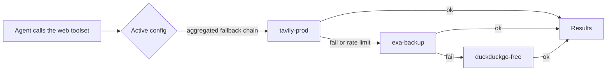
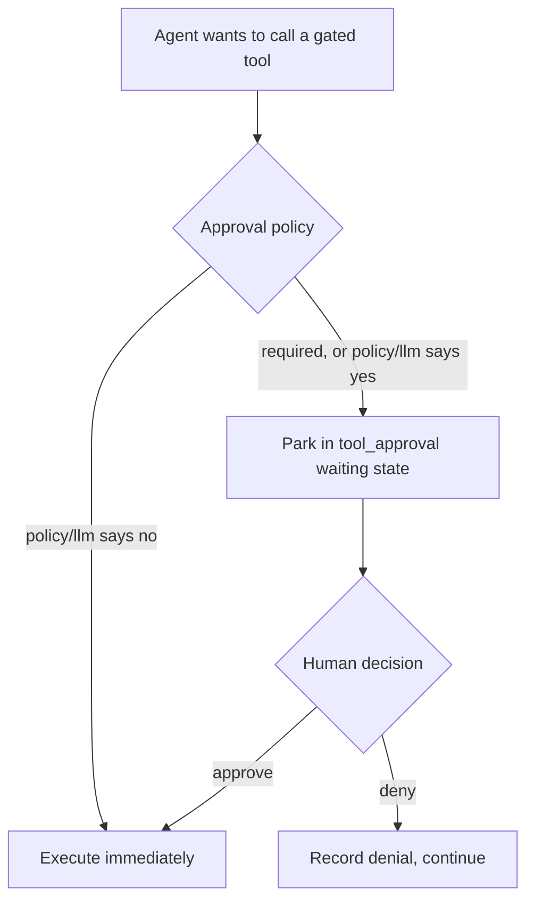

# 9. Web search and tool safety

> Part of the [Microagents Thesis](README.md) series. Previous:
> [Harnesses](08-harnesses.md). Back to the [series index](README.md).

Two improvements round out the platform, both motivated by the same realities the rest of
the design ran into.

## Web search as a first-class citizen

Microagents frequently need live information, and retrieval is too important to bolt on ad
hoc. Primer treats web search through the same provider pattern as every other external
capability, described in [provider-pattern](../architecture/provider-pattern.md): a
provider entity, a registry, and an active-config singleton.

A web search provider names a backend and its config. The supported backends are
`duckduckgo`, `tavily`, `firecrawl`, and `exa`:

```json
POST /v1/web_search_providers
{
  "id": "tavily-prod",
  "provider_type": "tavily",
  "config": { "type": "tavily", "api_key": "tvly-REDACTED" }
}
```

Which provider an agent actually uses is decided by a singleton, the active web search
config. It runs in one of two modes. In single mode it points at one provider; in
aggregated mode it lists several provider ids as an ordered fallback chain, so if the
first backend fails or is rate-limited the next is tried.

```json
PUT /v1/active_web_search_config
{
  "config": { "mode": "aggregated", "provider_ids": ["tavily-prod", "exa-backup", "duckduckgo-free"] }
}
```



Agents reach this through the reserved `web` toolset, so any agent can search the web with
a clean, single tool and never carry provider details in its context. The provider entity,
the registry, the active-config fallback chain, and the toolset are documented in
[web-search](../subsystems/web-search.md).

## Tool safety through approvals

When agents can discover and call any tool (see [chapter 3](03-tool-routing.md) and
[chapter 4](04-internal-collections.md)), and can run for a long time without a human
watching (see [chapter 7](07-event-driven-execution.md)), you need a gate. Primer adds an
approval mechanism so that sensitive tool calls can require human sign-off, or a policy
decision, before they execute.

A tool approval policy targets a specific tool by toolset id and tool name, and chooses
how the gate is decided. The simplest is unconditional human approval:

```json
POST /v1/tool_approval_policies
{
  "id": "p-delete-session",
  "toolset_id": "system",
  "tool_name": "delete_session",
  "approval": { "type": "required" }
}
```

The `approval` field is a discriminated union with three kinds:

- **required**: every call is gated and waits for a human.
- **policy**: a Rego policy decides, evaluating to `{"required": bool, "reason"?: str}`.
  For example, gate only destructive operations:

  ```rego
  package primer.tool_approval
  default required := false
  required if input.tool_name == "delete_production"
  ```

- **llm**: a small model judges the call against a prompt and decides whether to gate it.

When a gated call is reached, the run parks in a `tool_approval` waiting state (the same
park-and-resume machinery from [chapter 7](07-event-driven-execution.md)). The pending
approval exposes the `tool_call_id`, the `tool_name` and `toolset_id`, the `arguments` the
agent wants to pass, the `policy_id` and `approval_type` that gated it, an optional
`gate_reason`, and when it parked. A human approves or denies; the run resumes and either
executes the call or records the denial. The per-turn approval gate inside an agent is
described in [agents](../subsystems/agents.md), and the graph-level checkpoint is in
[graphs](../subsystems/graphs.md).



## Where this leaves us

Following the chain to its end, the pieces compose into a single idea: Primer is a
microagents platform. It lets you orchestrate many small, specialized agents, each with a
deliberately optimized context, into systems that take on work a single large agent would
otherwise have to do alone. Context discipline keeps each agent small, internal
collections and system tools keep the reachable surface large, workspaces carry state,
graphs sequence and synchronize, event-driven execution lets the work run for as long as
it needs, harnesses make a tuned configuration shareable, and web search and approvals make
the agents useful and safe in the open.

For the honest caveat that all of this is still a hypothesis under test, see the closing
note in the [series index](README.md).
