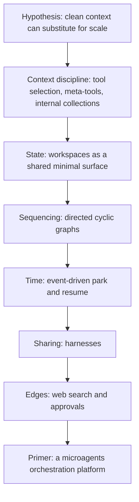

# Primer: The Microagents Thesis

## About this series

This is the origin story and the design philosophy behind Primer. The rest of the
developer docs explain *what* each subsystem does and *how* it is built; this series
explains *why* any of it exists. It is written as a narrative because Primer was built
as a narrative: each subsystem is the answer to a problem the previous one exposed.

The argument runs in a single direction. A hardware constraint forced a hypothesis
about how language models actually work. The hypothesis implied a way of building with
them. Building that way exposed a chain of obstacles, and each subsystem in Primer is
the removal of one obstacle. By the end the pieces compose into a platform for
orchestrating many small, specialized agents instead of prompting one large one.

Each chapter below covers one step of that chain in detail, with concrete,
codebase-accurate examples you can copy and adapt.

## The chapters

1. [The constraint and the hypothesis](01-constraint-and-hypothesis.md) - the 16 GB
   VRAM ceiling, why attention gets noisier as context grows, and the bet that context
   quality can stand in for model scale.
2. [Microagents](02-microagents.md) - decomposing a task into many small,
   single-purpose agents, and the two questions that decomposition forces.
3. [Tool routing](03-tool-routing.md) - killing tool-definition bloat with MCP tool
   selection and the two meta-tools that let one agent reach every tool in the system.
4. [The internal Collection system](04-internal-collections.md) - generalizing the tool
   trick to agents, graphs, and collections, plus the system tools that let an agent act
   on what it finds.
5. [Workspaces](05-workspaces.md) - a distilled sandbox that is just a shared file and
   process space, and why most "rich tooling" is really structured file operations.
6. [Graphs](06-graphs.md) - directed, possibly cyclic graphs of agents, and the
   producer/judge feedback loop the thesis most wanted to test.
7. [Event-driven execution](07-event-driven-execution.md) - trading compute for time,
   yielding tools, the park/resume model, `ask_user`, and scheduled triggers.
8. [Harnesses](08-harnesses.md) - making a tuned, context-optimized configuration into a
   portable, shareable bundle ("Helm for Primer").
9. [Web search and tool safety](09-web-search-and-safety.md) - the two finishing
   touches: first-class web retrieval and human approval gates on sensitive tool calls.

## The thesis in one sentence

If a complex, long-running task can be split into many small, self-sufficient pieces,
and each piece is handed to a model inside a context optimized for just that piece, then
a fleet of small specialized runs can compose into output that rivals a single frontier
run.

## How the story maps to the code

Each chapter corresponds to concrete subsystems. Use this as an index from idea to
implementation.

| Idea | Chapter | Subsystem docs |
| --- | --- | --- |
| Context quality over raw scale | [01](01-constraint-and-hypothesis.md) | [agents](../subsystems/agents.md) |
| Many small specialized agents | [02](02-microagents.md) | [agents](../subsystems/agents.md), [sessions](../subsystems/sessions.md) |
| Tool selection and meta-tools | [03](03-tool-routing.md) | [knowledge](../subsystems/knowledge.md), [semantic-search](../subsystems/semantic-search.md) |
| Internal collections and system tools | [04](04-internal-collections.md) | [knowledge](../subsystems/knowledge.md) |
| Shared file and process space | [05](05-workspaces.md) | [workspaces](../subsystems/workspaces.md), [sessions](../subsystems/sessions.md) |
| Directed cyclic graphs | [06](06-graphs.md) | [graphs](../subsystems/graphs.md) |
| Park and resume; long-running work | [07](07-event-driven-execution.md) | [chats](../subsystems/chats.md), [triggers](../subsystems/triggers.md), [channels](../subsystems/channels.md) |
| Portable, shareable bundles | [08](08-harnesses.md) | [harness](../subsystems/harness.md) |
| First-class web search; approvals | [09](09-web-search-and-safety.md) | [web-search](../subsystems/web-search.md), [agents](../subsystems/agents.md) |
| The uniform provider shape underneath | all | [provider-pattern](../architecture/provider-pattern.md) |

## The capstone view

Read the platform as layers, where each layer exists to protect the layer below it from
the context bloat that would otherwise sink the thesis.

## A note on honesty

The claim that orchestrated small models can match a frontier model on a decomposed task
is a hypothesis, not a settled result. Primer is the apparatus built to test it. The
design is opinionated precisely because the hypothesis is specific: keep contexts small,
specialize relentlessly, decompose aggressively, sequence with structure, and let time do
the work that raw scale would otherwise do. If the hypothesis holds, the techniques help
frontier models too, because the attention dilution they fight is universal. If it only
half holds, the platform is still a clean way to build multi-agent systems on modest
hardware.

Back to the [developer docs index](../README.md).
