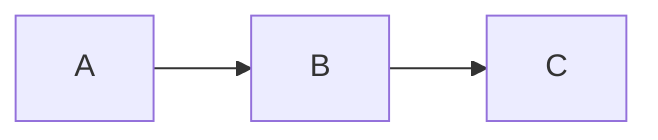
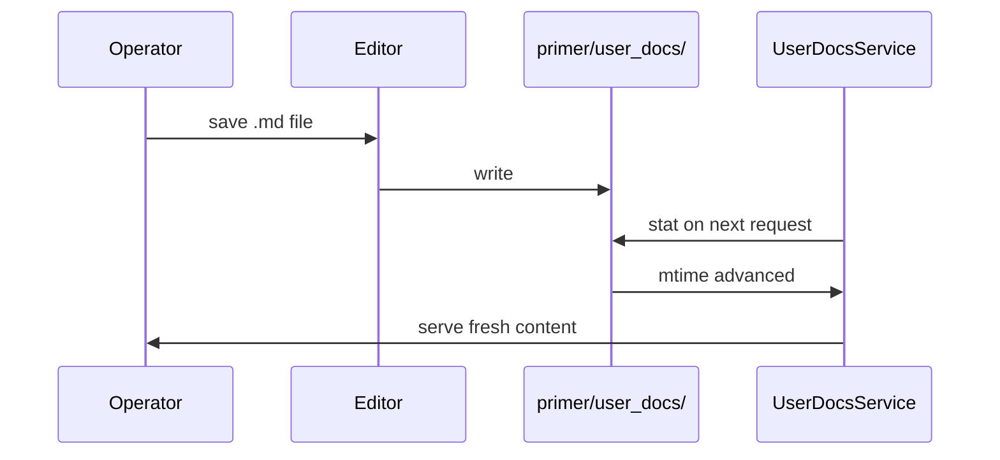

## Where docs live

Operator-facing docs live under `primer/user_docs/<section>/<slug>.md`.
The five visible sections are listed in `primer/user_docs/manifest.yaml`;
the manifest also controls ordering and visible-doc membership.
Docs on disk but absent from the manifest are reachable by direct
slug but hidden from the left nav.

## The lint

The doc service runs the lint after every reload. In dev mode
(env var `PRIMER_USER_DOCS_STRICT=1`) lint errors block startup.
In production they log loudly and the offending doc is excluded
from the manifest. Highlights:

- The em-dash character is rejected anywhere in a doc source. Use
  the regular hyphen, the double-hyphen, or rework the sentence.
- Every `ref:<slug>` and `ai-doc:<slug>` resolves at lint time.
- Every `mockup:<id>` is checked against the live embed registry.
- Required frontmatter keys: slug, title, summary, section.
  Cookbook docs also require difficulty, time_minutes, tags.

## The six directives

The full set of callout severities is rendered below side by side
so authors can pick one without leaving the page:

```mockup:docs-callout-demo
```

### callout

```callout:info
This is what the info kind looks like in real prose.
```

### ref

```ref:concepts/what-is-an-agent
Links to another doc by slug.
```

### ai-doc

```ai-doc:agents
```

### code-tabs

```code-tabs:python,curl
--- python
print("hello")
--- curl
curl https://example/v1/hello
```

### mermaid



### mockup

The directive shape is the same as the others; the body is parsed
as JSON and forwarded to the embed component as props.

## A small architecture sketch



## Adding a new directive

The directive registry lives in `ui/vendor/markdown.jsx`. Each
directive registers a handler via `window.MarkdownDirectives.register`.
The handler receives the body and returns a React node.
