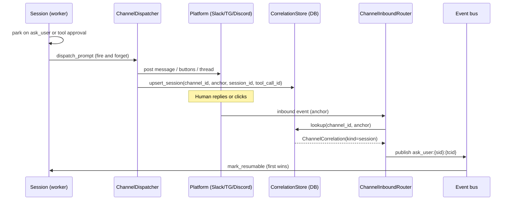

## What the association does

A workspace can be linked to one channel at a time via `Workspace.channel_association`. When a link exists, every session running inside that workspace that parks on a yielding tool (`ask_user`, a tool approval gate, or `inform_user`) automatically dispatches a message to the associated channel room.

This is what makes long-running agent work practical over Slack, Telegram, or Discord: the session parks (releases its compute lease), a message lands in the channel, and the session resumes the moment a human replies or clicks an approval button. No one needs to watch the primer console.

Key properties of the association:

- **One channel per workspace.** A workspace has at most one associated channel at any time. Replace it by setting a new one; clear it with a DELETE.
- **All gates forward.** There are no per-gate flags. When an association exists, `ask_user`, tool approvals, and `inform_user` all route to the channel. To stop forwarding, clear the association.
- **Mutable at any time.** The association can be set or cleared without stopping running sessions. New dispatches after the change use the new value; already-dispatched in-flight gates are unaffected.
- **Correlation survives restarts.** Primer writes a `ChannelCorrelation` row for each gate it dispatches. The row maps the platform thread (or Telegram gate message) to the specific session and tool-call ID. If the API restarts between dispatch and reply, the row is still there and the inbound reply routes correctly.

## Inbound and outbound flow



The dispatch is fire-and-forget: the worker schedules it as a background task after parking so a slow platform post never delays releasing the session's compute lease.

The anchor identifies the conversation thread (a Slack thread timestamp, a Discord message ID, or a Telegram gate-message ID). The `ChannelCorrelation` row keyed on `(channel_id, anchor)` is what connects the platform reply back to the right session. The unique index on `(channel_id, anchor)` plus an atomic `INSERT ... ON CONFLICT DO UPDATE` means two workers racing to dispatch the same gate write exactly one correlation row, preventing double-resume.

## Attribution header

Every gate post includes a one-line attribution header showing which workspace and session the prompt came from:

```
🛠 Workspace: blog-assistant · Session: sess-abc123
[agent's ask_user prompt text]
```

This lets a channel that serves multiple workspaces and sessions stay organised. The header is omitted when neither a workspace name nor a session label is available.

## Configuration

The association is set on the workspace row. No separate entity is created.

| Field | Notes |
|---|---|
| `channel_id` | The ID of the Channel to forward gates to. Must refer to a channel that exists. |

A workspace has the full `channel_association` cleared (null) by default. Setting it via PUT activates forwarding immediately; DELETE clears it.

## Walkthrough: associate a workspace with a channel

**Via the console:**

1. Open **Workspaces** in the sidebar and select the workspace you want to configure.
2. Find the **Channel** section in the workspace detail panel.
3. Click **Set channel**.
4. Choose the channel from the dropdown. Only channels with at least one provider configured appear in the list.
5. Click **Save**. The workspace detail page now shows the associated channel name.

**Via the REST API:**

```
PUT /v1/workspaces/{workspace_id}/channel_association
Content-Type: application/json

{"channel_id": "channel-abc123"}
```

To clear the association:

```
DELETE /v1/workspaces/{workspace_id}/channel_association
```

**Via agent tools:** The `system__set_workspace_channel_association` and `system__clear_workspace_channel_association` tools do the same from inside a session, letting an agent configure its own workspace's channel routing programmatically.

## Allowed agents and the chat surface

The `allowed_agents` and `allow_agent_switch` settings live on the channel's chat config, not on the workspace association. If the channel has chat enabled:

- `allow_agent_switch: false` (default): users cannot run `/agent` to change which agent handles their chat.
- `allow_agent_switch: true`: users may run `/agent`; the picker shows all agents unless `allowed_agents` is set.
- `allowed_agents: ["agent-id-1", "agent-id-2"]`: restricts the `/agent` picker to the listed agents (and requires `default_agent` to be in the list).

These settings are on the channel itself, not on the association, because they describe what is allowed for that room regardless of which workspace sessions are currently forwarding to it.


```ref:channels/channels
Channel rooms, chat config, and in-channel commands.
```

```ref:channels/channel-providers
Platform credentials and provider setup.
```

```ref:workspaces/workspace-providers
Workspace provider types and creating workspaces.
```

```ref:workspaces/yielding-tools
How ask_user and tool approval gates park and resume a session.
```
