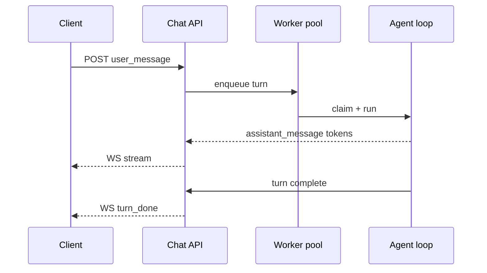

## Chats vs sessions

A chat is an interactive multi-turn conversation. A session is a
headless long-running run. The two share most of the agent loop
machinery; they differ in who drives the next turn.

|  | Chat | Session |
|---|---|---|
| Driver | Operator (or another agent) sends each turn | Agent runs to completion or yield |
| Surface | Console chat UI, WebSocket clients | REST + scheduler |
| Persistence | Ordered ChatMessage rows | Transcript + workspace state |
| Real-time | Streamed over WebSocket | Polled or webhooked |
| Auto-compaction | Yes, when message count grows | No |

```callout:tip
Pick chat when there is a human (or agent) keeping the loop going
turn by turn. Pick session when the work runs unattended and the
operator just wants to see the result at the end.
```

## The turn shape

Every chat turn moves through the same sequence: the client sends
a user message, the server enqueues a turn, a worker claims it,
the agent loop runs, the assistant message streams back.



The crucial detail: the WebSocket is a delivery channel, not a
binding. If the client disconnects mid-turn, the agent keeps
running. When the client reconnects, the API replays the messages
that landed during the disconnect.

## Cancel, pause, resume

Chats inherit the same pause + resume primitives as sessions. An
operator can pause an in-flight chat at any turn boundary; the
worker drains, the chat goes parked, and the next user message
restarts the loop. Cancelling moves the chat to a terminal state
without dropping the transcript.

## Auto-compaction

When the message count crosses a threshold (per agent config), the
chat auto-compacts: old turns are summarised into a synthetic
message, and the original ChatMessage rows are kept for audit but
excluded from the context window on the next turn.

```ref:concepts/sessions
The session concept covers the parked/resume primitive in detail;
chats reuse the same machinery for cancellable turns.
```
