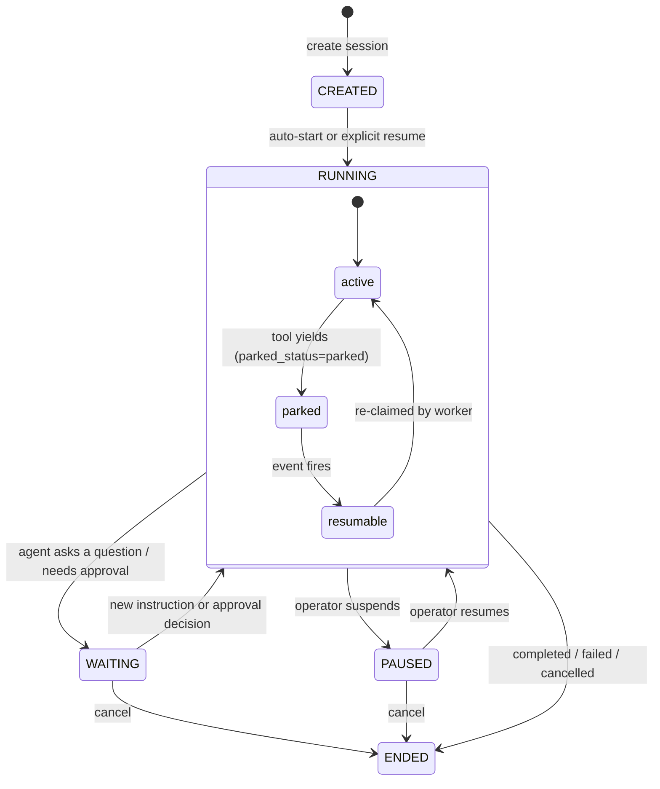

## What a session is

A session is one run of one agent (or one graph) on one workspace. It is
the right primitive when the work is "do this thing, take as long as you
need, here are the tools, tell me when you are done." The operator fires
it off, the agent works through turns until it finishes or needs input,
and the transcript survives restarts because it lives in the workspace's
own `messages.jsonl` file rather than in memory.

The same agent can run many sessions against the same workspace at the
same time without sharing memory. Each session owns its own state slot
inside the workspace's git-backed `.state/` directory.

```callout:tip
Think of an agent as a function definition and a session as a single
call to that function, with every intermediate step, tool call, and
tool result recorded in order.
```

## Lifecycle and status

A session moves through five statuses:



**CREATED** -- the row exists but no worker has been told to run it yet.
**RUNNING** -- a worker holds a lease and a turn is in flight. Within RUNNING,
a session can temporarily *park* when a tool yields (waiting for a trigger,
an external event, or an approval decision); parking releases the worker
lease so no compute is consumed while the session waits.
**WAITING** -- the agent reached a stopping point and needs external input,
either because it asked a question or because an approval gate tripped.
**PAUSED** -- an operator requested suspension; the session resumes on demand.
**ENDED** -- terminal. Ended sessions carry a reason: `completed`, `failed`,
`cancelled`, `workspace_lost`, or `force_deleted`.

## Turns

A turn is one cycle through the agent loop: the worker claims the session,
runs the model, dispatches any tool calls, and persists the results. Each
turn produces an ordered list of messages -- assistant text, tool calls,
and tool results -- appended to `messages.jsonl` inside the workspace.

The per-turn audit log (`turns.jsonl`) records a structured boundary event
on every start, completion, failure, yield, and resume, so operators can
trace exactly what happened during each turn without replaying the full
message history.

## Pause, resume, cancel

All three controls are durable. If the API process restarts between the
cancel request and the next worker claim, the cancel flag survives in the
database and the worker honours it on the next claim. Pause and resume work
the same way: the request lands in storage and the worker observes it at
the next turn boundary.

Cancel is terminal. A cancelled session ends immediately at the next turn
boundary; its transcript is preserved. Sessions cannot be restarted after
they end.

## Relationship to workspaces

A session is always scoped to one workspace. The workspace provides the
filesystem the agent reads and writes. The session's message history and
audit log live inside that workspace's `.state/sessions/<session_id>/`
directory, so the history travels with the workspace if the workspace is
moved or archived.

A workspace can host many sessions from different agents or graphs running
at the same time. Sessions do not share memory, but they do share the
workspace filesystem, so concurrent sessions can read and write the same
files.

## Sessions vs chats

Sessions run headless under a scheduler. Chats are interactive: each turn
waits for a human (or another agent) to send a message before proceeding.
Both use the same agent loop and the same tool-dispatch machinery, but a
chat has a live WebSocket surface for streaming replies turn by turn, while
a session streams into `messages.jsonl` and the operator polls or subscribes
for results.

```ref:features/sessions
The feature walkthrough covers creating, monitoring, and steering sessions
from the console.
```

```ref:reference/api-sessions
The API reference documents all session fields, lifecycle endpoints, and the
WebSocket streaming protocol.
```
