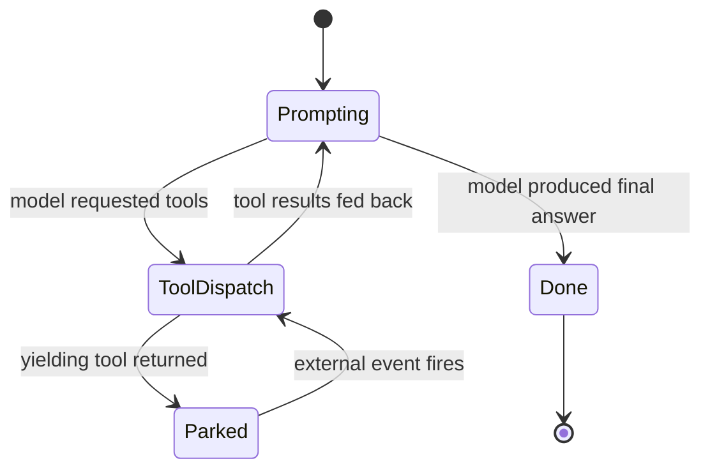

## What a session is

A session is a single agent run with persistent state. The agent
reads from a workspace, calls tools, produces output, and either
finishes or parks waiting for something. Either way the transcript
lives in storage: kill the worker, restart the process, the
session picks up exactly where it left off.

Sessions are the right primitive when the work is "do this thing,
take as long as you need, here are the tools, tell me when you are
done." Chats are the right primitive when the work is an
interactive back-and-forth.

```callout:tip
A useful way to think about sessions: an agent is a function;
the session is a single invocation of that function with all the
parameters, intermediate state, and tool calls recorded in order.
```

## The turn loop

Inside a session every turn moves through the same states. The
model is asked to produce output; if it requests tool calls,
those dispatch; the results feed back in; the loop continues until
the model declines to call more tools or yields.



The `Parked` state is what makes sessions cheap at scale. A
session waiting for a trigger or a tool approval consumes zero
compute; storage holds the transcript, the worker lease releases,
and the slot frees for other work.

## Where state lives

Three different kinds of state coexist per session:

- The **transcript** is the ordered list of model + tool messages.
  Persisted in the entity store; survives restarts.
- The **workspace** is the filesystem the agent reads and writes.
  Persisted on disk by the workspace provider; survives sessions.
- The **waiting marker** is the per-session `waiting.json` inside
  the workspace that captures what the session is parked on.

## Relationship to agents

A session always belongs to exactly one agent. The agent owns the
model, the prompt, and the toolset bindings; the session owns the
transcript and the workspace pointer. Multiple sessions can run
against the same agent at the same time without sharing memory.

```ref:features/agents
The feature walkthrough covers how to define an agent and bind its
toolsets.
```
