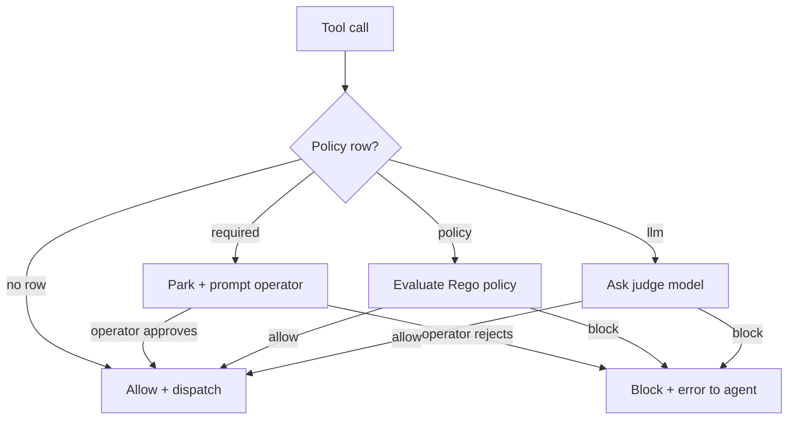

## What approval gates do

Every tool dispatch passes through an approval gate before it
runs. By default the gate is a no-op and the tool dispatches
immediately. When an operator configures a policy on the tool,
the gate consults that policy on every call. If the policy says
allow, dispatch proceeds. If it says block, the call parks.

The mechanic is identical to a yielding tool: the call parks in
storage, the worker lease releases, and the call resumes when the
operator (or the judge, or the policy) decides.

## The three policy kinds

Primer ships three approval gate kinds. Each row in the policy
table picks exactly one kind.

| Kind | Who decides | Operator-facing |
|---|---|---|
| `required` | A human operator clicks approve or reject | Yes -- prompt lands in IC bell or channel |
| `policy` | A Rego policy evaluates against the call args | No -- deterministic, no UI |
| `llm` | A judge model returns allow or block | No -- silent unless audit replay |

## The decision flow

The gate looks up the policy by `(toolset_id, tool_name)` on every
call. If no policy is configured the gate is skipped entirely.



## What the operator sees

An approval prompt for a `required` policy lands on whichever
channel the agent is configured to talk on, or on the IC bell in
the console if no channel is configured. A Slack delivery looks
like this:

```mockup:channels-prompt
{ "platform": "slack", "question": "Approve write_workspace_file call on prod-config?", "options": ["Approve", "Reject"], "agentName": "deploy-bot" }
```

The operator clicks; the gate resolves; the tool dispatches (or
errors). A reject is not a retry; the tool sees a clean error and
the agent decides what to do next.

```callout:info
Policies are cheap to add and cheap to remove. Flipping a policy
on for a sensitive tool takes effect on the next call without a
restart. Use that to dial up oversight when something looks off
without taking the tool offline.
```

## Where to next

The feature-level walkthrough of approval policies (the policy
editor + the approvals queue + the per-tool override controls)
ships in Phase F of the doc rollout.
