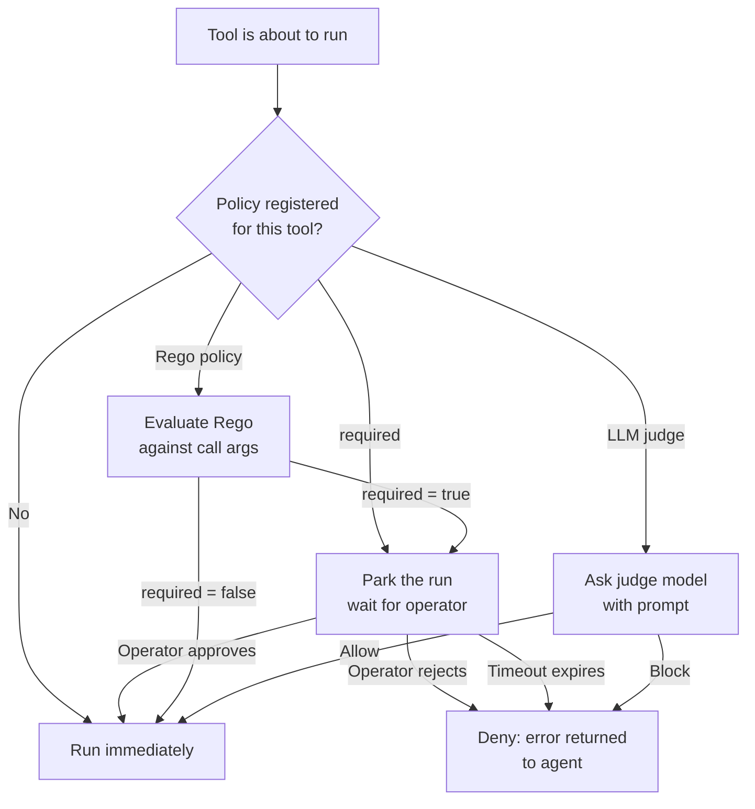

## What tool approval is

Tool approval is a pre-dispatch gate. Every time a tool is about to run,
the runtime checks whether a policy has been registered for that tool.
When no policy exists the tool runs immediately. When a policy exists it
becomes the decision-maker: should this particular call proceed or should
it be denied?

The gate is not the same as disabling a tool. The tool remains available
to the agent; approval decides, call by call, whether execution is
permitted. A single policy can allow most calls and block only the ones
that match a specific condition.

Mechanically, a blocked call parks the run the same way a yielding tool
does. The worker releases its lease, freeing capacity, and the run stays
in storage until the gate resolves. If no resolution arrives within the
configured timeout the gate closes and the call is treated as denied.

## The three approval strategies

Primer provides three strategies. A policy row picks exactly one.

**Required.** The gate always waits for a human operator to respond. The
pending call is surfaced so the operator can see what tool is about to run,
which arguments it was given, and which agent and session triggered it.
The operator approves or rejects. Approved calls execute; rejected calls
produce a clean error that the agent can reason about. No automated path
can bypass a required gate.

**Rego policy.** A small Open Policy Agent policy, written in Rego and
stored with the policy row, evaluates the call arguments. The policy must
produce a single boolean: `required := true` means gate and wait; `required
:= false` means allow immediately. The evaluation is deterministic and
synchronous. No human is involved. For example, a policy that gates only
calls whose `tool_name` equals a sensitive operation will allow all other
calls to pass through without delay.

**LLM judge.** A designated model is given a prompt describing the call and
asked whether it is safe. The model returns allow or block and a short
reason. This strategy is probabilistic: the same call could produce
different outcomes across runs. The judge's decision and its reason are
recorded on the pending approval row so operators can audit why a call was
allowed or blocked.

## Decision flow



## What a parked approval looks like

When a required policy parks a call, the pending approval record exposes:

- The tool name and toolset it belongs to.
- The full arguments the agent passed.
- The policy identifier and approval type.
- The agent and session that triggered the call.

An operator can inspect this record and respond. Approving unparks the run
and the tool dispatches as if it had been allowed immediately. Rejecting
unparks the run with a denial error, which the agent receives as a tool
result and can handle as it sees fit.

## Timeout and denial

Every policy can carry a `timeout_seconds` value. If the gate has not been
resolved within that window, the platform resolves it automatically as a
denial. The run unparks, the agent receives the denial error, and the
pending record is closed. This prevents a required gate from blocking a
run indefinitely when no operator is available.

## Policy lifecycle

Policies are additive and reversible. A policy can be disabled without
deleting it, which restores the tool to immediate dispatch. Re-enabling
the policy reinstates the gate on the next call. Deleting the policy
removes the gate entirely. None of these changes require a restart, and
none affect calls that are already parked: those resolve under the policy
that was in effect when they parked.

```ref:features/tool-approval
The feature walkthrough covers creating policies, managing the approvals
queue, and configuring per-tool overrides.
```

```ref:reference/api-tool-approval
The API reference documents all policy fields, the pending-approval
schema, and the respond endpoint.
```
