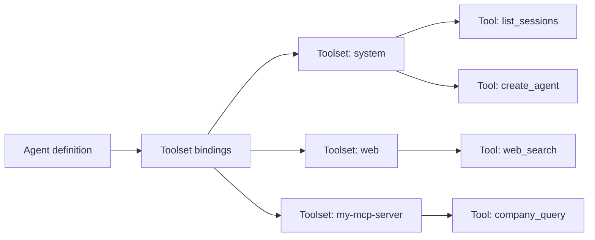

## The distinction

A **tool** is a single callable function: `read_file`,
`web_search`, `list_sessions`. A **toolset** is a named
collection of tools that belong together: `system`, `web`,
`workspaces`, `misc`.

The two levels serve different roles:

- An agent is bound to **toolsets**. Binding a toolset grants
  the agent access to every tool inside it.
- An agent can also declare individual **tool ids** to restrict
  its context to a subset of a toolset's tools.

The toolset abstraction means an operator does not need to
enumerate individual tool names to grant or deny a capability.
Binding `web` is the decision "this agent can browse the web";
the specific functions that implement browsing are an
implementation detail of the toolset.

```callout:tip
A useful heuristic: toolsets answer "what kind of work can
this agent do?" -- browse the web, manage sessions, read
workspace files. Individual tool ids answer "which exact
actions within that kind?" -- only read, not write.
```

## How binding gates what an agent can call

At session start, primer assembles the agent's effective tool
list from its bindings. Only the tools in that list are
presented to the model; the rest of the platform surface is
invisible to it. An agent cannot call a tool it was not bound
to, regardless of how it phrases the request.



Binding determines what the agent can ask to call. The tool
approval layer -- a separate mechanism -- determines what the
agent is actually allowed to execute at runtime.

## Built-in toolsets

Primer ships seven built-in toolsets that are always available
without registration:

| Toolset | What it covers |
|---|---|
| `system` | Manage agents, sessions, chats, workspaces, triggers, and channels. |
| `web` | Web search and HTTP fetch primitives. |
| `workspaces` | Read, write, edit, glob, grep, and exec within a workspace. |
| `misc` | Small stateless utilities such as datetime, JSON, and UUID generation. |
| `search` | Semantic search over internal collections and knowledge bases. |
| `trigger` | Manage triggers and subscriptions; the `subscribe_to_trigger` yield tool. |
| `harness` | Harness-specific tools bundled with an imported harness. |

## Custom toolsets via MCP

Operators extend the tool surface by mounting external MCP
(Model Context Protocol) servers as toolsets. Each mounted
server becomes a toolset of kind `mcp`; its tools appear
alongside the built-in toolsets and can be bound to any agent.

Primer supports two MCP transports:

- **stdio** -- the server runs as a subprocess, and tool calls
  travel over standard input and output. Useful for local or
  containerised MCP servers.
- **HTTP (streamable)** -- the server exposes an HTTP endpoint,
  and tool calls travel over the streamable-HTTP MCP transport.
  Useful for remote or hosted MCP servers.

An agent bound to an MCP toolset can also select specific tool
ids from it, so a single large MCP server does not have to
expose its entire surface to every agent.

## Primer as an MCP server

Primer can also act as an MCP server, exposing a curated subset
of its own built-in tools at a dedicated endpoint. The operator
configures an allowlist; only allowlisted tools from built-in
toolsets are visible to external MCP clients. Tools from
user-defined toolsets are never exposed through this surface.

## Where tool approval fits

Every tool call passes through the approval gate before it
runs. The gate may be a no-op, an operator approval prompt, a
Rego policy evaluation, or an LLM judge. Binding and approval
compose: binding decides what the agent can request, approval
decides what actually executes.

```ref:features/mcp-server
The feature walkthrough covers mounting MCP servers, selecting
tools, and configuring the Primer MCP server endpoint.
```

```ref:reference/api-toolsets
The API reference documents the toolset and tool endpoints,
including listing tools and managing MCP toolset configurations.
```
