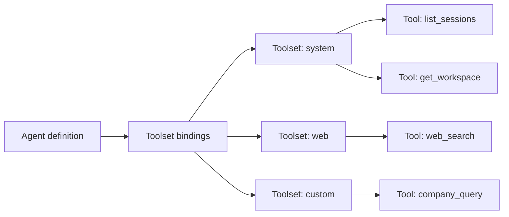

## The distinction

A **tool** is one callable function: `read_file`, `list_sessions`,
`web_search`. A **toolset** is a named bundle of tools that ship
together: `system`, `web`, `workspaces`, `misc`.

Why two levels? Toolsets are the unit of binding. An agent binds a
toolset; the agent can now call every tool inside that toolset and
no others. The toolset abstraction means an operator does not have
to remember every individual tool name to grant or deny access.

```callout:tip
A useful heuristic: toolsets are 'what kind of work can this
agent do' (browse the web, manipulate sessions, read workspace
files); tools are 'what specific action'. The agent only ever
talks about tools; the operator only ever binds toolsets.
```

## The component picture

The arrows show where each layer reaches the next:



## Built-in toolsets

Primer ships four built-in toolsets, each backed by a Python
module under `primer/toolset/`:

| Toolset | What it covers |
|---|---|
| `system` | Manage agents, sessions, chats, workspaces, triggers, channels via the REST surface. |
| `web` | `web_search`, `web_fetch`, http-request primitives. |
| `workspaces` | Read/write workspace files, watch files, run commands. |
| `misc` | Small stateless utilities (datetime, json, etc.). |

These are always available; the operator does not register them.

## Custom toolsets

Operators add custom toolsets in three ways:

- Define an in-process Python toolset and register it at startup
  (typical for company-internal tooling).
- Configure an external MCP server as a toolset. The MCP transport
  carries each tool call to and from the external process.
- Import a harness, which ships its own bundled toolset + agents.

## Where tool approval fits

Every tool dispatch passes through the tool approval gate before
it actually runs. The gate may be a no-op (no policy configured),
an operator approval prompt, a Rego policy evaluation, or an LLM
judge call. The mechanic is the same in every case: the tool stops
before dispatch, the gate runs, and the result decides whether
the tool actually executes.

```callout:tip
Bind a toolset before you build a policy. The two layers compose:
binding determines what the agent can ask to call; approval
policy determines what the agent is actually allowed to do.
```
