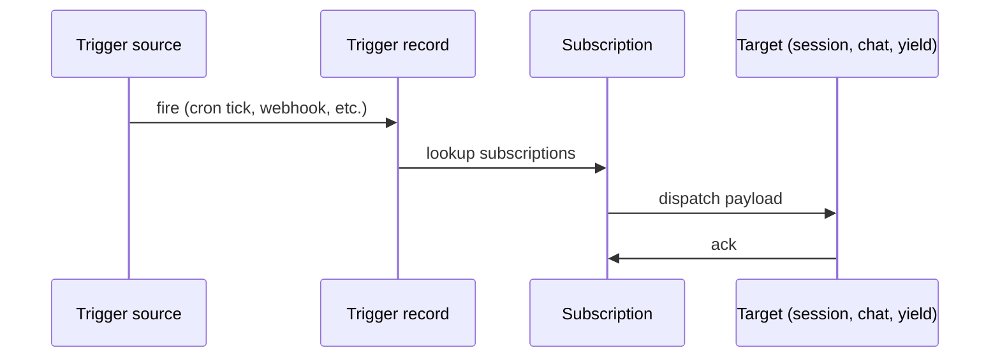

## The split

A **trigger** is the event source: a cron schedule, an inbound
webhook, a channel message pattern. A **subscription** binds a
trigger to a consumer that does something with the payload: start
a session, post to a chat, resume a parked yield.

The split matters because the same trigger often has multiple
consumers. A 'new GitHub PR' trigger might wake a review session
AND post a chat message AND resume a parked subscribe yield, all
on the same fire.

## The dispatch chain

When a trigger fires the chain walks through three layers:



The trigger record carries the source config (the cron expression
or the webhook secret). The subscription carries the target id
plus the dispatch mode.

## Trigger kinds

Three kinds ship in primer today:

- **Cron**: fires on a five-field UTC cron expression. The
  minimum granularity is one minute.
- **Webhook**: a `/v1/triggers/{id}/webhook` endpoint that fires
  on inbound HTTP POST.
- **Channel pattern**: matches inbound channel messages against a
  regex; fires when the pattern matches.

## Subscription targets

Three target kinds:

- **start_session**: provisions a fresh session against an agent.
- **post_to_chat**: appends a user message to an existing chat.
- **resume_yield**: wakes a parked tool yield by event key.

```callout:tip
The third target is the most general. Anything that yields with
the trigger's event key resumes on the next fire. This is how
'wait for the user to fix the build' patterns work: the agent
yields on `gh:pr:N:check_run:success`, the trigger fires when the
check passes, the agent resumes with the payload as the tool
result.
```

## Where to next

The feature-level walkthrough of triggers (the create flow on the
console plus the REST + Python invocation) ships in Phase F of
the doc rollout.
