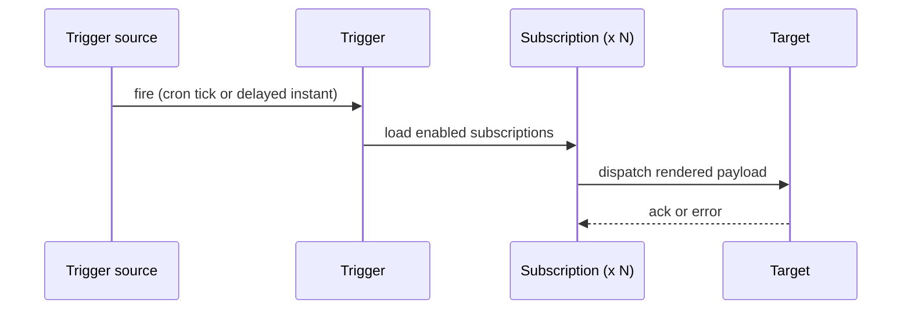
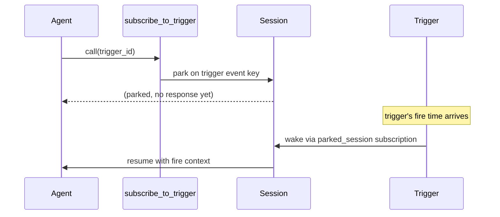

## The split

A **trigger** is the fire source: a one-off instant (delayed)
or a recurring cron schedule (scheduled). A **subscription**
is the delivery rule: what to do when the trigger fires.

Keeping them separate means one trigger can fan out to many
targets simultaneously. A single nightly schedule might start
a fresh agent session, post a summary to a chat, and wake a
session that has been parked waiting for the run.

## Trigger kinds

Two trigger kinds ship today:

- **Delayed** -- fires once at a specified UTC instant, then
  disables itself. Useful for one-off deferred work.
- **Scheduled** -- fires on a five-field UTC cron expression
  on a configurable timezone, then advances to the next
  scheduled instant. The minimum granularity is one minute.

A scheduled trigger carries a catchup policy that controls
what happens after a disabled window:

| Policy | Behaviour on re-enable |
|---|---|
| `one` | Fire once for the entire missed window (default). |
| `all` | Fire once per missed instant (capped at 64). |
| `none` | Skip the missed window entirely. |

## Subscription kinds

Four subscription kinds control where a fire lands:

- **`chat_message`** -- appends a user message to an existing
  chat, with an optional Jinja2 payload template rendered
  against the fire context.
- **`agent_fresh`** -- starts a fresh session against a named
  agent in a named workspace, using the live agent definition
  at fire time.
- **`graph_fresh`** -- starts a fresh graph session against a
  named graph in a named workspace.
- **`parked_session`** -- wakes a session that is currently
  parked on the trigger. This kind is written automatically
  by the `subscribe_to_trigger` tool; operators do not
  create it directly.

A subscription can also carry a `parallelism` setting (`skip`
or `queue`) that controls what happens if a previous fire's
action is still in progress when the next fire arrives.

## The dispatch chain

When a trigger fires, the platform fans every enabled
subscription out to its kind-specific dispatcher:



Each subscription renders its `payload_template` against the
fire context (trigger id, slug, kind, fired-at timestamp, and
a deterministic fire id) and dispatches independently. One
subscription failing does not block the others.

## The park and resume model

The most powerful use of triggers is to park a running session
until a trigger fires, then resume it with the fire context as
the tool result. An agent calls `subscribe_to_trigger` with a
trigger id; the session parks immediately and releases its
worker. No compute is consumed while parked. When the trigger
fires, the `parked_session` subscription wakes the session
and passes the fire context back as the tool result; the agent
continues from where it left off.



This pattern lets an agent express "do this once the nightly
build finishes" or "retry when the approval arrives" without
holding a connection or polling. The subscription row is
written before the park takes effect, so a fire that races
the park still finds the subscription and wakes the session
correctly.

```callout:tip
`subscribe_to_trigger` pairs with scheduled triggers for
recurring agent work: the agent parks after each run, the
trigger wakes it on the next cron tick, and the cycle
continues without a held connection.
```

```ref:features/triggers
The feature walkthrough covers creating triggers and
subscriptions, firing triggers manually, and viewing fire
history.
```

```ref:reference/api-triggers
The API reference documents the trigger and subscription
endpoints, including CRUD, enable/disable, and the
manual fire-now surface.
```
