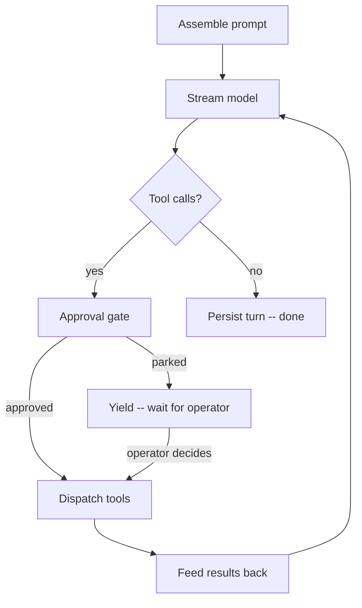

## The shape of an agent

An agent is a small, reusable definition. It has three parts:

- **Model binding** -- which LLM provider and model name to use.
- **System prompt** -- one or more text fragments that establish role, tone, and
  constraints for every turn.
- **Toolset allowlist** -- the set of toolsets (and individual tools within them)
  the agent is permitted to call.

The definition is immutable at runtime. Changing the system prompt or the tool
list creates a new version of the agent, not a new kind of entity. Every session
or chat started after the change picks up the new definition on its next turn.

```callout:tip
Think of an agent as a stateless function signature. The state -- the
conversation transcript, the filesystem the agent reads and writes -- lives
elsewhere. Multiple sessions or chats can invoke the same agent simultaneously
without sharing memory.
```

## The turn loop

When an agent is asked to do something, primer runs a turn loop:

1. Assemble the full prompt from system prompt plus conversation history.
2. Stream the model until it stops.
3. If the model requested tool calls, route each call through the approval gate,
   dispatch approved calls, and feed the results back as tool-result messages.
4. Go back to step 2.
5. When the model produces a final response with no pending tool calls, the turn
   is complete and the result is persisted.



Context grows with every round-trip. When it approaches the model's context
limit, primer automatically compacts the oldest turns into a summary message so
the agent can keep working without losing its broader intent.

## How an agent differs from related concepts

| Concept | What it is |
|---|---|
| Agent | A reusable definition: model + prompt + tools |
| Session | One headless run of an agent on a workspace |
| Chat | An interactive multi-turn conversation bound to an agent |
| Graph | A pipeline that routes between multiple agents |

An agent does nothing on its own. It runs only when something -- a session, a
chat, a graph node, or a trigger -- invokes it with a concrete input and a place
to write output.

## Tool routing

Every tool the agent may call is identified by a scoped name:
`toolset_id__tool_name`. The double-underscore separator keeps tool names
unambiguous when the agent has access to multiple toolsets, MCP servers, or
workspace-provided tools that happen to share bare names.

Before a tool dispatches, an approval gate evaluates any configured policy on
that `(toolset_id, tool_name)` pair. By default the gate is a no-op. When a
policy is configured, it can let the call through immediately, block it, or park
the agent until an operator or judge decides.

```ref:features/agents
The feature walkthrough covers creating an agent, binding toolsets,
and configuring the model.
```

```ref:reference/api-agents
The API reference documents all agent fields and the CRUD endpoints.
```
