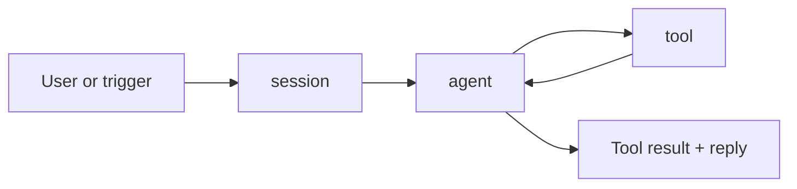

## The shape of an agent

An agent in primer is a small bundle: a model id, a system prompt,
and a set of toolset bindings. The model decides what to say; the
tools decide what it can do.

```callout:tip
Think of an agent as a stateless function. State lives in the
session (the conversation transcript) or in workspaces (the
sandboxed environment). Agents themselves can be invoked many
times in parallel without sharing memory.
```

## The turn loop

Every time the agent is asked something, primer runs a turn loop:
prompt the model, run the requested tool calls, feed results back,
loop until the model declines to call more tools.



## Where it gets used

Agents are the leaf nodes of every primer workflow. Triggers
schedule them, channels deliver their replies, sessions hold their
context across turns.

```ref:features/agents
The feature-level walkthrough has the create flow and the
configuration knobs.
```
