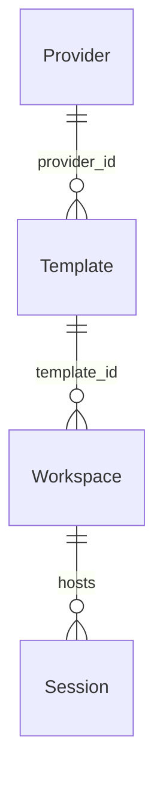
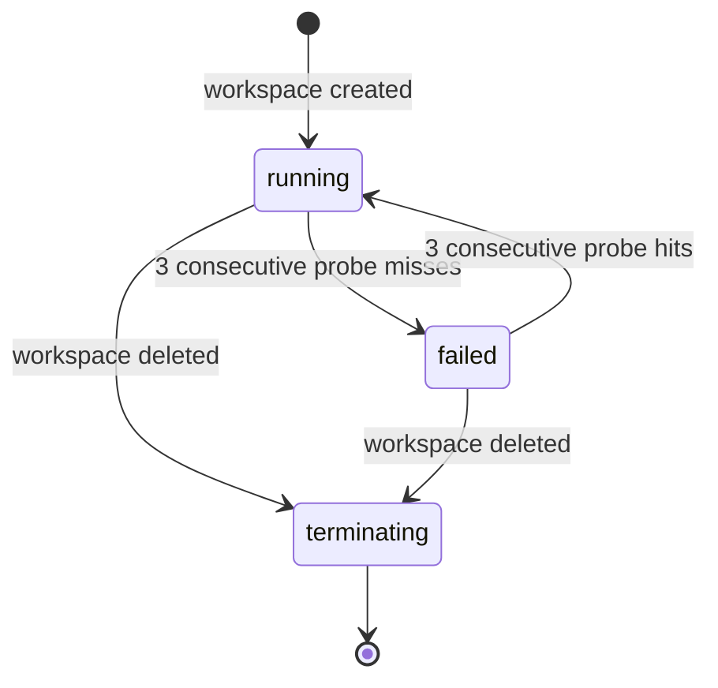

## What a workspace is

A workspace is primer's unit of execution isolation. It is a
materialised sandbox that gives an agent a real place to live:
a filesystem the agent can read and write, a shell it can exec
commands in, and a git-backed `.state/` history that records
every state-changing turn as a commit. Sessions and chats run
inside a workspace; the workspace persists across turns and
across the sessions that run on it.

The key property of a workspace is that it owns both the
filesystem and the execution environment together. Separating
them would reopen the host-side execution hole the sandbox is
meant to close, so the two are always a single unit.

## Three vocabulary levels

Three distinct concepts share the workspace namespace:

- A **provider** is the backend configuration: which runtime
  (local filesystem, container daemon, Kubernetes cluster) and
  how to reach it. One provider per backend per installation.
- A **template** is a parameterised recipe: which image or base
  path, which environment variables, which seed files and init
  commands, which resource limits. Many templates can reference
  one provider.
- A **workspace instance** is the live, materialised sandbox
  created from a template. Many instances can be created from
  one template; each instance hosts one or more sessions.



## Three backends

Primer ships three backends that all satisfy the same
workspace contract:

| Backend | Where the filesystem lives | Where commands run |
|---|---|---|
| Local | A directory on the host | The host process |
| Container | A volume inside a Docker/Podman container | Inside the container |
| Kubernetes | A PVC attached to a StatefulSet pod | Inside the pod |

For container and Kubernetes backends, every file operation and
shell command travels over a persistent WebSocket to an
in-container `primer-runtime` server. This design keeps
materialisation times low and execution latency sub-millisecond
because the connection stays open for the lifetime of the
workspace rather than being re-established per operation.

The local backend requires only the host filesystem and `git`.
Container and Kubernetes backends each require the respective
daemon or cluster to be reachable by the server.

## Lifecycle and the probe loop



A background probe pings every running workspace on a
configurable interval (default 30 seconds). Three consecutive
missed pings flip the workspace to `failed` and end every
session on it with reason `workspace_lost`. Three consecutive
successful pings after a failure restore it to `running`.

## The state history

Every assistant turn that writes to the workspace is committed
to the `.state/` git repo with structured trailers recording
the workspace, session, agent, and operation. The commit log is
a linear, greppable audit trail of what changed, when, and
which session caused it.

The `.tmp/` subtree holds oversized tool output that is too
large to fit in context; it is per-session and cleaned up when
the session ends. Both `.state/` and `.tmp/` are reserved and
protected from direct mutation through the file API.

## Multi-session collaboration

Multiple sessions can run against the same workspace instance
at the same time. They share the filesystem, so a producer
session can write a file that a reviewer session reads in the
same workspace. Commits from concurrent sessions are
serialised by a workspace-wide lock to avoid git index
conflicts.

## Templates and ephemerality

A template can seed the workspace with files (inline text,
fetched URLs, or document references), environment variables,
and commands to run at materialisation time. The image or base
path is baked into the template; packages are not installed at
materialisation time -- they belong in the image so
materialisation is deterministic and fast.

Workspaces are not ephemeral by default. They persist until
explicitly deleted. If the use case calls for a fresh sandbox
per run, create a new workspace instance per run and delete it
on completion.

```ref:features/workspaces
The feature walkthrough covers creating providers, templates,
and workspace instances, browsing files, and reading the state
log.
```

```ref:reference/api-workspaces
The API reference documents every workspace, template, and
provider endpoint including the file sub-API and the git log
surface.
```
