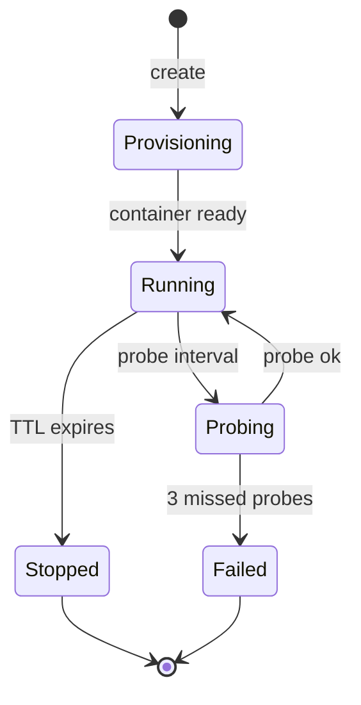

## What a workspace is

A workspace is primer's unit of execution isolation. Concretely:
a filesystem (local directory, container volume, or remote PVC,
depending on the provider) plus a git repo on top of it that
tracks every state-changing tool call.

Sessions and chat turns run inside one workspace. The workspace
gives them a place to read files, run commands, and persist their
output across turns. The git history gives the operator a replay
log: which session changed which file at which turn.

## Three levels: provider, template, instance

The vocabulary trips up new operators. Three distinct things:

- A **workspace provider** is the backend (local, docker,
  kubernetes). One per primer install per backend.
- A **workspace template** is a parameterised recipe: 'a Python
  3.13 dev environment with these packages preinstalled'. Many
  templates per provider.
- A **workspace instance** is a live workspace created from a
  template. Many instances per template; each scoped to one or
  a handful of sessions.



## The empty state

A fresh install has no workspaces. The workspaces page surfaces
this:

```mockup:workspace-empty
{ "providerName": "local", "ctaLabel": "Create workspace" }
```

Pick a template (or import one), hit the button, and the provider
provisions an instance. The instance lands in `Provisioning` for a
few seconds, then transitions to `Running`.

## TTL and the probe loop

Workspaces have a TTL. By default a workspace stops automatically
30 minutes after the last session ends. The probe loop pings each
running workspace every 30 seconds (configurable via
`PRIMER_WORKSPACE_PROBE_INTERVAL_SECONDS`); after three missed
pings the workspace flips to `Failed`.

```callout:warning
Tight TTL is good for cost control but bad for long-running
sessions that pause for hours waiting for a trigger. When a
session yields on a trigger that may not fire today, bump the
workspace TTL to cover the expected window or set it to 0 (no
TTL) and rely on manual cleanup.
```

## Where to next

The feature-level walkthrough of workspaces ships in Phase E with
the full create + template + instance flow on the console.
