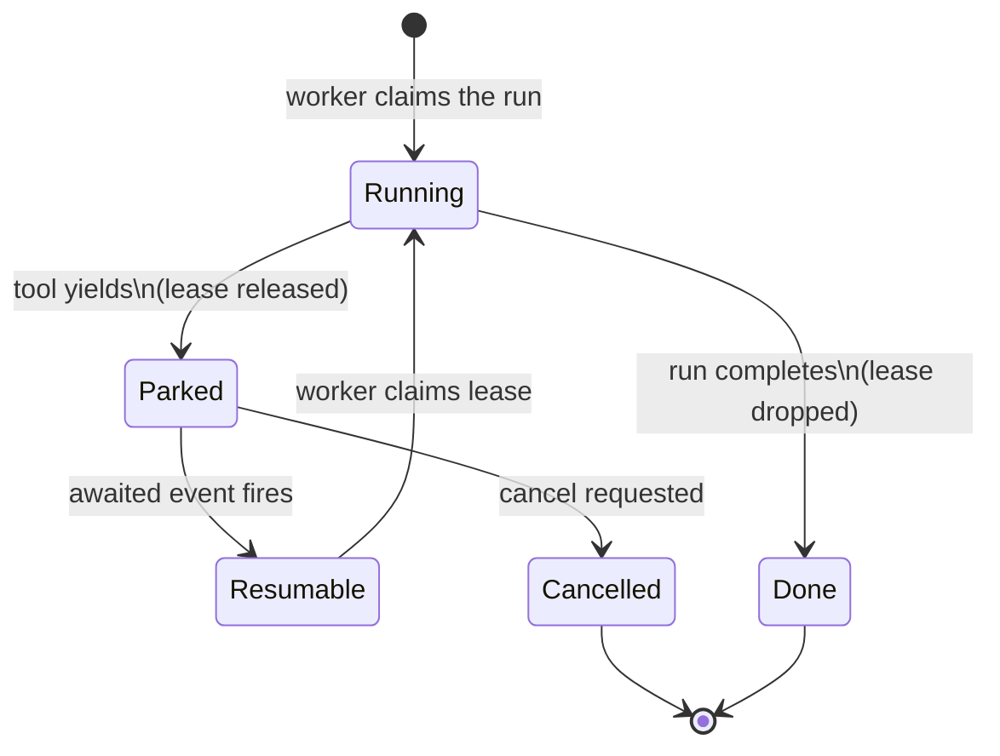

## The core problem

Some tool calls are not instant computations. They are waits:

- `ask_user` waits for a person to type a reply.
- `subscribe_to_trigger` waits for a scheduled time or an incoming event.
- `sleep` waits for a duration.
- `watch_files` waits for a filesystem change.
- A tool approval gate waits for an operator decision.

If each waiting tool occupied a worker for its entire duration, a modest
number of concurrent long-running waits would exhaust the worker pool. A
system with ten workers and eleven sessions all waiting on user replies
would leave the eleventh session unable to run any new work at all.

Yielding breaks that coupling. A yielding tool does not hold a worker while
it waits.

## What a yielding tool does

When a tool yields, it returns a sentinel value instead of a result. The
runtime detects the sentinel and does three things atomically:

1. Writes the paused state (the in-progress message history, the tool
   name, and the event key the tool is waiting on) into durable storage.
2. Releases the worker lease, making the worker immediately available to
   claim other work.
3. Marks the run as parked.

From that point the run consumes no compute. The parked state persists in
the database; a process restart does not lose it.

## How the run resumes

Each yielding tool registers an event key when it parks. Common keys look
like:

- `ask_user:{session_id}:{call_id}` for `ask_user` waits.
- `trigger:{trigger_id}` for `subscribe_to_trigger` waits.
- `approval:{policy_id}:{call_id}` for tool-approval gates.
- `timer:{call_id}` for timed sleeps.

When the awaited event fires (the user replies, the trigger ticks, the
operator approves), the platform publishes a message on that key. The
event listener picks it up, finds the matching parked row, and marks it
resumable. From that moment the run is eligible to be claimed by any
available worker.

## The claim and lease model

The claim engine is the piece that decides which worker runs which unit of
work, and prevents two workers from running the same unit simultaneously.
Every runnable or resumable entity holds a lease row. A worker claims the
lease atomically (using a row-level lock on Postgres, or a serialized
write in single-process mode). Only the lease-holder may execute the turn.

A parked run holds no lease. The lease was released when the tool yielded.
When the run becomes resumable the claim engine re-arms its lease row,
making it eligible for the next `claim_due` sweep. Whichever worker wins
the claim resumes the run from exactly where it parked.

## State diagram



The key insight is the gap between Parked and Resumable: during that
window the run exists only in storage. No worker slot is consumed, no
network connection is held. A parked run survives an arbitrary wait
without resource cost.

## Lease TTL and worker crashes

A held lease carries an expiry timestamp. The holding worker refreshes
that timestamp (heartbeats) on a regular interval while the turn is in
flight. If the worker crashes without releasing the lease, the timestamp
eventually passes and the lease becomes claimable again. Another worker
can then re-claim the run and continue.

The platform enforces that the lease TTL is at least twice the heartbeat
interval. This means a single missed heartbeat cannot expire a lease; only
a genuine stall or crash causes expiry. The double-heartbeat margin is a
startup invariant: the platform refuses to start with a misconfigured TTL.

## Exactly-once execution

Two safety properties hold across the yielding lifecycle:

**No double-claim while running.** The `FOR UPDATE SKIP LOCKED` strategy
on Postgres means competing workers skip a row that is already locked.
Only one worker ever holds a lease at a time.

**Stale workers cannot write.** If a worker loses its lease (because the
TTL expired while it was stalled) and then tries to commit results, the
platform detects the mismatch and rejects the write. The stale worker
discards its output. The run is re-executed by the worker that holds the
current lease.

```ref:features/sessions
The sessions feature walkthrough shows the lifecycle states a run moves
through, including how parked sessions appear to operators.
```

```ref:reference/api-sessions
The API reference covers the session fields that reflect parked status,
the pending ask_user endpoint, and the yields cancel endpoint.
```
