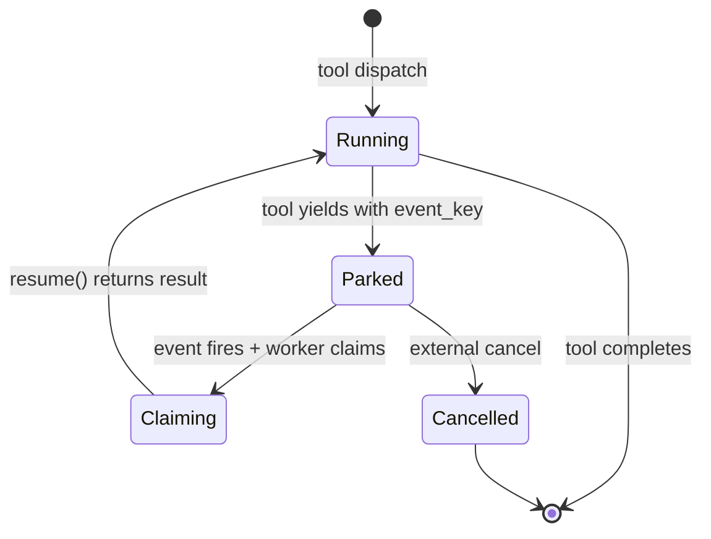

## Why yield

Many tool calls are not 'compute and return'. They are 'wait for
something to happen'. `ask_user` waits for the user to reply.
`subscribe_to_trigger` waits for a cron tick or a webhook.
Tool approval waits for an operator click.

A naive implementation holds a worker thread for the duration of
the wait. For long waits (hours, days) that does not scale: every
parked tool occupies a worker slot, and the slot count is the cost
budget.

The yielding mechanism solves this. A yielding tool returns a
`Yielded` sentinel instead of a result. The execution manager
sees the sentinel, parks the call in storage, releases the worker
lease, and exits. Zero compute is consumed until the wait ends.

## The lifecycle

A yielded call moves through four states. The crucial transition
is between `Parked` and `Claiming`: the claim engine ensures that
exactly one worker picks up the resume.



## The event key

When a tool yields it registers an event key. Common keys look
like:

- `ask_user:{session_id}:{turn_call_id}` for ask_user prompts.
- `trigger:{trigger_id}` for subscribe_to_trigger waits.
- `approval:{policy_id}:{call_id}` for tool-approval gates.

When something publishes an event with a matching key, the
scheduler picks it up, finds the parked row, claims it, and calls
the tool's `resume()` hook with the event payload as input.

## The claim engine

The claim engine is the piece that prevents two workers from
processing the same parked row. Every resumable row carries a
lease. A worker takes the lease atomically (Postgres row-level
lock or SQLite serialised write); only the lease-holder runs
`resume()`. If the lease-holder dies, the lease expires and
another worker can claim.

```callout:warning
The lease TTL trades off against fast-failure response. A short
TTL recovers quickly from worker crashes but rejects an in-flight
resume if the worker briefly stalls. The default 60 seconds is a
reasonable middle ground; the `worker.lease_ttl_seconds` config
knob is there for environments that need different.
```

## Cancellation

A parked session can be cancelled from the console or the REST
API. The cancel publishes a synthetic event on the call's key
with a Cancelled payload; the worker that claims resumes the tool
with the cancellation, the tool propagates the cancellation as an
error, and the session moves to a terminal state.
