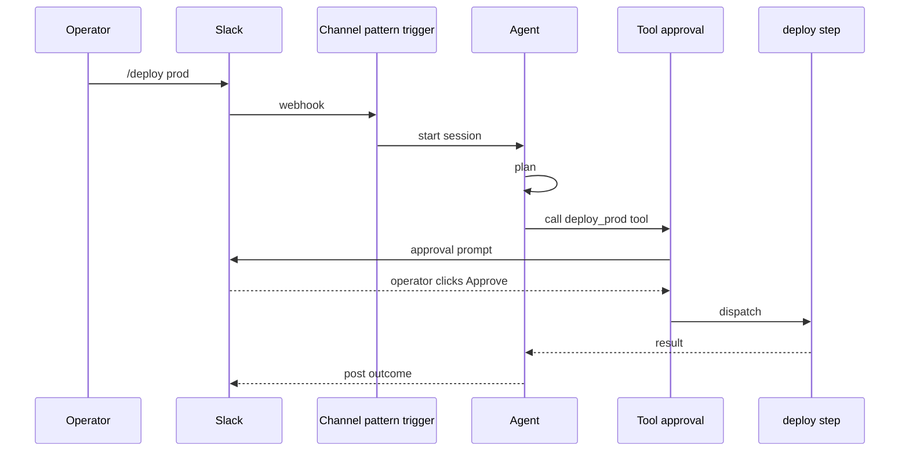

## Goal

An operator types `/deploy prod` in a Slack channel; an agent
plans the deploy, posts the plan as an approval prompt, waits
for a human click, then runs the actual deploy step.

## The dispatch chain



The two critical layers: the channel-pattern trigger picks up
the slash command; the tool approval gate pauses the deploy
step until a human approves.

## Steps

The trigger pattern catches the slash command:

```code-tabs:python
--- python
client.triggers.create(
    name="deploy-command",
    kind="channel-pattern",
    channel_id="ops-deploy",
    pattern=r"^/deploy\s+(\w+)$",
    subscription_target="start_session",
    subscription_target_id="deploy-bot",
)
```

Set the approval policy on the deploy tool:

```code-tabs:python
--- python
client.tool_approval.create(
    toolset_id="deploy-tools",
    tool_name="deploy_prod",
    kind="required",
)
```

```callout:danger
The deploy_prod tool is the irreversible step. Do not skip the
approval policy in dev and add it in prod; the agent's prompt
encodes assumptions about the gate. Test the gate-pause path
before the first production fire.
```

## Verification

Type `/deploy prod` in the channel. The agent posts the plan,
then the deploy tool fires the approval prompt:

```mockup:channels-prompt
{ "platform": "slack", "question": "Plan: 3 services to deploy, 2 migrations to run, 1 cache flush. Approve?", "options": ["Approve", "Reject"], "agentName": "deploy-bot" }
```

The operator clicks Approve; the tool dispatches; the agent
posts the result. The operator clicks Reject; the tool returns
a clean error; the agent posts the rejection.

## Gotchas

```callout:warning
The approval prompt fires on the same channel by default. If
the channel is high-traffic, the prompt scrolls away before the
approver sees it. Either pin the approval prompt to a separate
moderator-only channel, or have the agent ping the approver
explicitly.
```

- Plan + approval doubles the round-trip time. A 30-second
  deploy with an approval gate is now a 30-second-plus-N-minute
  deploy where N is the approver's response time.
- If the approver is asleep, the parked session holds a worker
  slot. Either set a TTL on the parked yield (auto-reject after
  M minutes) or page the approver via a separate channel.
