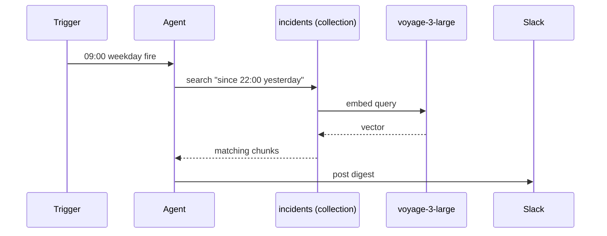

## Goal

Every weekday at 09:00 local time, a cron trigger runs an agent
that pulls overnight incident write-ups from an indexed
collection and posts a tagged digest to the ops Slack channel.

## The dispatch chain



## Steps

The cron expression. 09:00 Asia/Dubai is 05:00 UTC:

```code-tabs:python,curl
--- python
client.triggers.create(
    name="incident-digest-weekday",
    kind="cron",
    cron_expression="0 5 * * 1-5",
    subscription_target="start_session",
    subscription_target_id="incident-digest-bot",
)
--- curl
curl -X POST https://primer.example/v1/triggers \
  -H "Authorization: Bearer $TOKEN" \
  -d '{"name":"incident-digest-weekday","kind":"cron","cron_expression":"0 5 * * 1-5","subscription_target":"start_session","subscription_target_id":"incident-digest-bot"}'
```

The agent's prompt instructs it to filter by recency and group
by severity. The collection's metadata schema includes
`severity` and `started_at` so the agent can filter without
guessing.

```callout:tip
The query the agent issues is natural-language. The SSP scores
chunks by semantic similarity; recency filtering uses the
collection metadata, not the query. Make sure incidents land
with accurate timestamps.
```

## Verification

The first Slack post the morning after setup looks like:

```mockup:channels-prompt
{ "platform": "slack", "question": "Overnight: 2 SEV-1, 4 SEV-2, 11 noise. Read more in thread.", "options": [], "agentName": "incident-digest-bot" }
```

## Gotchas

```callout:warning
Cron expressions use UTC. 09:00 in your local time and 09:00
UTC are not the same unless you happen to live in London. The
trigger detail page shows the next fire in UTC so you can
double-check.
```

- The collection must be populated before the trigger fires;
  otherwise the agent posts 'nothing overnight' every morning.
- If you want weekend coverage, change `1-5` to `*` in the cron
  expression.
