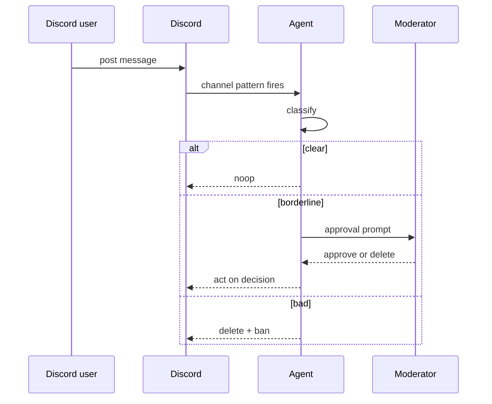

## Goal

Every new Discord message in a moderated channel runs through a
classifier agent. Borderline content fires an approval prompt
to a moderator role; clear content passes through silently;
obviously bad content auto-deletes.

## The dispatch chain



## Steps

Create a channel-pattern trigger that fires on every message:

```code-tabs:python
--- python
trig = client.triggers.create(
    name="mod-classifier",
    kind="channel-pattern",
    channel_id="discord-general",
    pattern=".*",
    subscription_target="start_session",
    subscription_target_id="moderator",
)
```

Configure the approval policy on the agent's `delete_message`
tool:

```code-tabs:python
--- python
client.tool_approval.create(
    toolset_id="discord-tools",
    tool_name="delete_message",
    kind="required",
)
```

```callout:info
The `required` kind means every delete prompts the moderator.
Use the `llm` kind once you trust the classifier's confidence
calibration; the gate auto-allows when the confidence exceeds
a threshold.
```

## Verification

A borderline message produces a Discord-formatted approval
prompt:

```mockup:channels-prompt
{ "platform": "discord", "question": "Delete this message? 'borderline content here'", "options": ["Delete", "Keep"], "agentName": "moderator" }
```

The moderator clicks; the agent executes the decision.

## Gotchas

```callout:danger
The `pattern: ".*"` matches every message, including the
moderator's approval clicks. Without a filter the bot loops on
its own output. Either filter the bot's own user id out of the
trigger, or use a more specific pattern.
```

- Discord webhook delivery is slightly delayed (1 to 5 seconds
  typical). Calibrate against the moderator's expected response
  window.
- The approval queue piles up if the moderator is asleep. Set
  a TTL on the parked yield so unresponded items auto-reject
  rather than blocking the channel-pattern fire.
