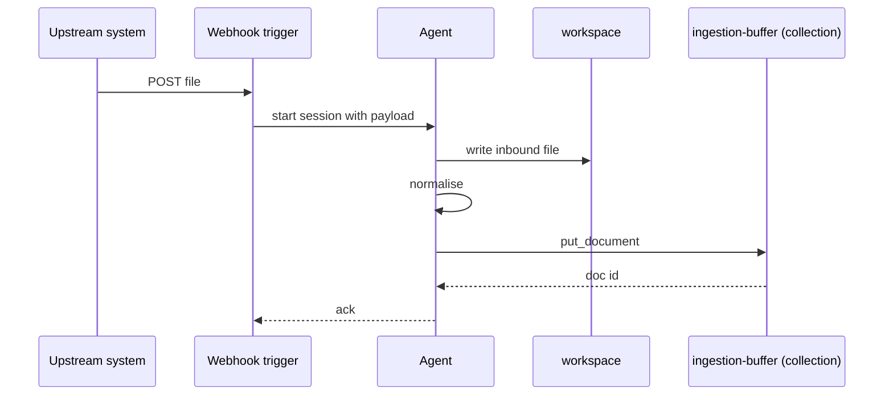

## Goal

External systems POST files to a primer webhook. The trigger
fires an agent that reads the inbound payload, normalises it,
and ingests it into a knowledge collection. End-state: every
upstream event ends up searchable within minutes.

## The dispatch chain



## Steps

Create the webhook trigger. The save flow auto-generates a
secret; the trigger detail page shows the POST URL and the
secret for the upstream system to use.

```code-tabs:python,curl
--- python
trig = client.triggers.create(
    name="inbound-ingest",
    kind="webhook",
    subscription_target="start_session",
    subscription_target_id="ingestion-bot",
)
print(trig.webhook_url, trig.webhook_secret)
--- curl
curl -X POST https://primer.example/v1/triggers \
  -H "Authorization: Bearer $TOKEN" \
  -d '{"kind":"webhook","name":"inbound-ingest","subscription_target":"start_session","subscription_target_id":"ingestion-bot"}'
```

Configure the upstream system to POST to the webhook URL with
the HMAC signature header. The trigger service verifies the
signature before firing.

```callout:warning
A webhook trigger with no signature verification is open to
anyone who finds the URL. Always verify the HMAC before
dispatching the session; primer enables this by default but
the operator can disable it (do not).
```

The agent's prompt:

```code-tabs:python
--- python
client.agents.create(
    name="ingestion-bot",
    model="claude-sonnet-4-6",
    toolsets=["system", "workspaces"],
    system_prompt=(
        "Receive an upstream event in the input. Write the "
        "payload to inbox/<id>.txt. Normalise it into markdown. "
        "Call put_document on ingestion-buffer with the "
        "normalised content."
    ),
)
```

## Verification

POST a sample file to the webhook URL. The trigger detail page
shows the fire; the session detail shows the workspace write
and the put_document call. The document appears in the
collection within seconds.

```mockup:collection-list-empty
{ "emptyLine": "0 documents in ingestion-buffer (refresh in 30s)" }
```

## Gotchas

```callout:danger
A burst of upstream events floods the worker pool. Add a queue
between the webhook and the trigger if upstream can send more
than the pool can drain (typical pool: 8; typical burst: 100+).
Alternatively, scale the worker pool and accept the burst.
```

- The webhook trigger does not deduplicate. Upstream retries on
  network blips can produce duplicate documents; the agent
  should idempotency-key the put_document call.
- Large file uploads (more than ~10 MB) need the workspace's
  inbox/ to have room. Bump the workspace template's disk
  allocation or process the file as a stream.
