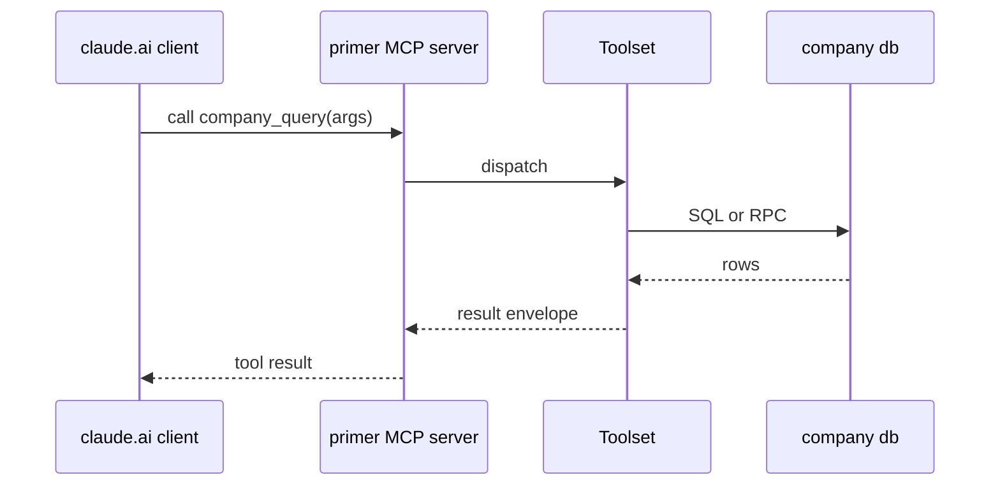

## Goal

Take an in-process toolset (a Python module under
`primer/toolset/`) and publish it through primer's MCP server so
claude.ai (or any MCP client) can call it as a remote tool.

## The dispatch chain



## Steps

Register the toolset at startup (no UI for custom toolsets in
v1; this is a Python wiring change):

```code-tabs:python
--- python
# In primer/toolset/_init_company.py or similar:
from primer.toolset.harness import build_harness_toolset_provider

company_tools = build_harness_toolset_provider(
    id="company",
    tools=[query_users, query_orders, run_report],
)

# Wire into the lifespan handler in primer/api/app.py:
provider_registry._company_toolset_provider = company_tools
```

Mark the toolset as exposed via MCP:

```code-tabs:bash,json
--- bash
curl -X PUT https://primer.example/v1/mcp/exposure/company \
  -H "Authorization: Bearer $TOKEN" \
  -d '{"exposed":true}'
--- json
{
  "exposed_toolsets": ["system", "search", "company"],
  "version": "2026-06"
}
```

Mint a bearer token with the right scopes:

```mockup:api-token-create
{ "phase": "form" }
```

## Connecting claude.ai

Open claude.ai/customize/connectors. Add a new MCP server, paste
the primer URL plus the bearer token. The connector validates,
lists the published tools, and registers them in the model's
tool palette.

```callout:tip
Scope the bearer token to the minimum the remote agent needs.
The company toolset's `query_users` should not need a
`sessions:write` scope; mint two separate tokens if different
remote agents need different surfaces.
```

## Verification

In a new claude.ai conversation, the model should be able to
call `company_query`. The MCP server logs every call; check
`primer.api.routers.mcp_exposure` log lines if the tool does
not appear.

## Gotchas

```callout:warning
Custom toolsets ship code that runs in the primer process. A
bug in `query_users` can crash the worker; an OOM in
`run_report` takes down the whole pool. Test in dev before
exposing remotely.
```

- The MCP rate limit is per-token. Slow tools serialise on the
  rate limit; bump
  `PRIMER_MCP__RATE_LIMIT_PER_SECOND` for high-traffic toolsets.
- Removing a tool from the exposed list does not invalidate
  in-flight calls; clients see the removal on the next
  reconnect.
