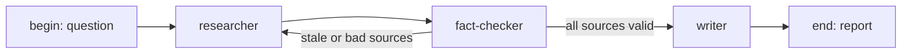

## Goal

A three-node graph turns an open research question into a
single reviewed report. The researcher digs up sources, the
fact-checker validates them against an internal collection, and
the writer composes the final report.

## The dispatch chain



The Check -> Research back-edge is a conditional: if any source
fails the fact-check, the graph re-runs the researcher with a
prompt that excludes the failing sources.

## Steps

Define three agents, then wire the graph.

```code-tabs:python
--- python
researcher = client.agents.create(
    name="researcher",
    model="claude-opus-4-8",
    toolsets=["web", "system"],
    system_prompt="Find authoritative sources for the question.",
)
checker = client.agents.create(
    name="fact-checker",
    model="claude-sonnet-4-6",
    toolsets=["system"],
    system_prompt="For each source, search internal knowledge for contradictions.",
)
writer = client.agents.create(
    name="writer",
    model="claude-opus-4-8",
    toolsets=["misc"],
    system_prompt="Write a 500-word report citing the validated sources.",
)
graph = client.graphs.create(
    id="research-pipeline",
    nodes=[
        {"id": "researcher", "agent_id": researcher.id},
        {"id": "fact-checker", "agent_id": checker.id, "deps": ["researcher"]},
        {"id": "writer", "agent_id": writer.id, "deps": ["fact-checker"]},
    ],
    edges=[
        {"from": "fact-checker", "to": "researcher",
         "condition": "{{ result.bad_sources | length > 0 }}"},
        {"from": "fact-checker", "to": "writer",
         "condition": "{{ result.bad_sources | length == 0 }}"},
    ],
)
```

```callout:warning
The Check -> Research back-edge can loop. Set a max-iterations
count on the graph or the run consumes its budget chasing a
question with no good sources. The graph runtime stops a run
that exceeds the count.
```

## Running the graph

```code-tabs:python,curl
--- python
run = client.graphs.run(
    graph_id="research-pipeline",
    input={"question": "How did the SLO methodology evolve from 2018 to 2026?"},
)
print(run.id, run.status)
--- curl
curl -X POST https://primer.example/v1/graphs/research-pipeline/runs \
  -H "Authorization: Bearer $TOKEN" \
  -d '{"input":{"question":"..."}}'
```

## Verification

The graph run detail page shows the three sessions in a
left-to-right strip. Click into each to see the transcript.

```mockup:graph-canvas-three-nodes
{ "selected": "agent" }
```

## Gotchas

```callout:tip
Pin each agent to a fixture set in eval mode before promoting
the graph. Drift in one agent affects the whole pipeline.
```

- The fact-checker reads an internal collection; populate it
  with known-good answers before the first run.
- Long-running graph runs hold workspaces. Either bind a
  longer-TTL workspace or split the writer into a fresh
  session.
