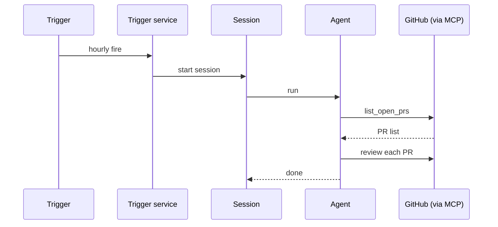

## Goal

A scheduled cron trigger fires every hour, runs an agent that
lists new pull requests on a configured repo, reviews each, and
posts comments via the GitHub MCP connector.

## Prerequisites

- A GitHub MCP server attached as a connector (the agent reaches
  GitHub through its tools).
- A workspace template that includes `git` and the repo cloned.

## The dispatch chain



## Steps

Create the trigger:

```code-tabs:python,curl
--- python
trig = client.triggers.create(
    name="pr-review-hourly",
    kind="cron",
    cron_expression="0 * * * *",
    subscription_target="start_session",
    subscription_target_id="pr-reviewer",
)
--- curl
curl -X POST https://primer.example/v1/triggers \
  -H "Authorization: Bearer $TOKEN" \
  -d '{"name":"pr-review-hourly","kind":"cron","cron_expression":"0 * * * *","subscription_target":"start_session","subscription_target_id":"pr-reviewer"}'
```

The agent's system prompt:

```callout:tip
Keep the agent's review tone consistent across runs. Pin the
prompt to the wording you want. Drift between runs reads as
flaky to PR authors.
```

## Verification

After one fire, check the trigger detail page run history. A
successful fire shows the session id; clicking it opens the
session detail with the review transcript.

```mockup:session-detail-panel
{ "sessionId": "sess-pr-001", "agentId": "pr-reviewer", "status": "done", "turnCount": 8 }
```

## Gotchas

```callout:warning
GitHub's API rate limit is per-token, not per-call. An agent
reviewing 20 PRs in one fire can exhaust a 5000-request budget
quickly. Use the GitHub App token (15000/hr) for production
runs.
```

- The cron expression is UTC. `0 * * * *` fires at the top of
  every UTC hour; convert to local time for documentation.
- A long-running review keeps the workspace alive past the
  default 30 minute TTL. Bump the template TTL or split the
  review into smaller sessions.
