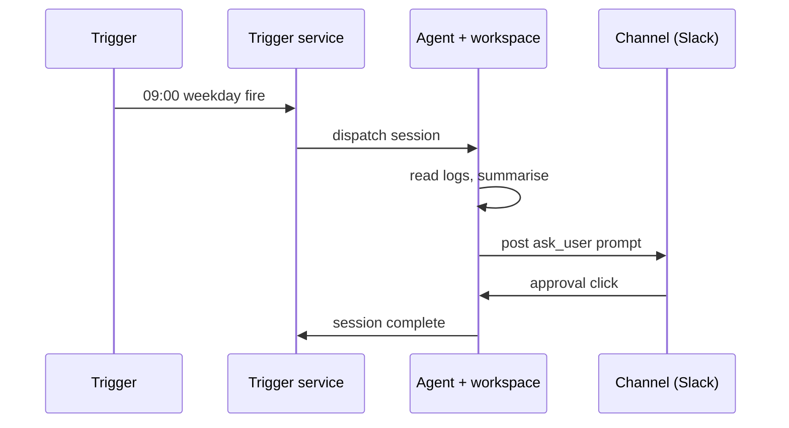

## Goal

End-to-end recipe: every weekday at 9 AM, an agent reads yesterday's
log files from a sandbox workspace, summarises them, and posts the
summary to a Slack channel as an `ask_user` prompt waiting for an
approval click.

The wiring touches four primer subsystems: trigger, agent, session,
workspace. Each step below maps to one of them.

## Prerequisites

You need an existing agent (see `features/agents`) bound to the
`system` toolset, and a Slack channel provider already configured
under Channels.

```callout:info
This recipe assumes the agent's system prompt already knows what
'summarise yesterday's logs' means. Tune the prompt against the
target log volume before scheduling; debugging a noisy run on
production data is painful.
```

## The dispatch chain

The trigger is the entrypoint; from there the chain fans out
through the trigger service into a session, which dispatches the
agent inside a workspace. Channels delivers the final reply.



## Steps

Step 1: create the trigger via the REST API. The cron field uses
the standard 5-field UTC expression; 9 AM Asia/Dubai is 05:00 UTC
on weekdays.

```code-tabs:python,curl
--- python
client.triggers.create(
    name="weekday-summary",
    cron_expression="0 5 * * 1-5",
    agent_id="weekly-digest",
    channel_id="ops-slack",
)
--- curl
curl -X POST https://primer.example/v1/triggers \
  -H "Authorization: Bearer $TOKEN" \
  -d '{"name":"weekday-summary","cron_expression":"0 5 * * 1-5","agent_id":"weekly-digest","channel_id":"ops-slack"}'
```

Step 2: confirm the trigger fires by hitting the Run now button on
the trigger detail page, or by waiting for the next scheduled
window.

```callout:warning
Slack rate-limits app messages at ~1 per second per channel. If
your agent posts intermediate progress lines, throttle them; the
trigger run logs will show 429s if you hit the cap.
```

## Verification

The Slack prompt looks like this when delivered:

```mockup:channels-prompt
{ "platform": "slack", "question": "Approve yesterday's summary?", "options": ["Approve", "Reject"], "agentName": "weekday-summary" }
```

Click Approve and the agent's session moves to `completed`.
Reject sends the session back through the prompt loop so the agent
can revise.

```callout:success
Once the verification click lands, the trigger is fully wired.
Subsequent fires run unattended; you only see them again if
approval times out or the agent returns an error.
```

## Gotchas

- Workspace TTL must outlast the agent's longest turn. Default 30
  minutes is usually fine; bump to 60 if the log volume is large.
- The Slack channel provider needs the `chat:write` and
  `chat:read` scopes; the OAuth flow surfaces this during channel
  provider setup.
