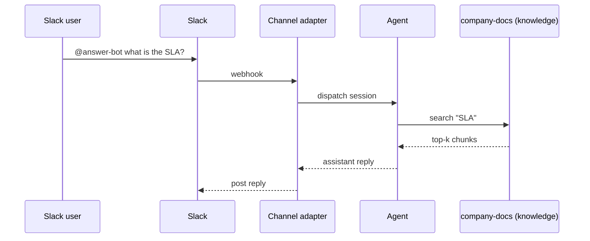

## Goal

By the end of this recipe, mentioning `@answer-bot` in Slack
with a question returns an answer drawn from your indexed
company-docs knowledge collection.

## Prerequisites

- A Slack channel provider already configured under Channels.
- A knowledge collection named `company-docs` populated with the
  documents the bot should answer from.

## The dispatch chain



## Steps

Create the agent bound to `system` (for collection search) and
`web` (in case the doc references external links):

```code-tabs:python,curl
--- python
agent = client.agents.create(
    name="answer-bot",
    model="claude-sonnet-4-6",
    toolsets=["system", "web"],
    system_prompt=(
        "Answer questions from company-docs. If the answer is "
        "not in the collection, say so plainly."
    ),
)
client.knowledge.bind_to_agent(
    agent_id=agent.id,
    collection_id="company-docs",
)
--- curl
curl -X POST https://primer.example/v1/agents \
  -H "Authorization: Bearer $TOKEN" \
  -d '{
    "name":"answer-bot",
    "model":"claude-sonnet-4-6",
    "toolsets":["system","web"]
  }'
```

Wire the Slack channel to the agent:

```code-tabs:python
--- python
client.channels.associate(
    agent_id="answer-bot",
    channel_id="ops-help",
    mode="mention_only",
)
```

```callout:info
The `mention_only` mode is what filters the bot to messages
that @-mention it. Without it the bot answers every message in
the channel, which is rarely what you want.
```

## Verification

Post a question in the channel. The reply lands as:

```mockup:channels-prompt
{ "platform": "slack", "question": "@answer-bot what is the SLA?", "options": [], "agentName": "answer-bot" }
```

(Followed by the agent's actual answer; the prompt mockup above
shows the user's question shape.)

## Gotchas

```callout:warning
The bot answers from whatever is in `company-docs` at query
time. If a doc is stale, the bot is too. Set a retention
window on the collection or run a re-index after each
documentation push.
```

- Slack rate-limits app messages at ~1 per second per channel;
  long answers stream rather than landing in one chunk.
- The `mention_only` mode strips the @-handle from the input
  the agent sees; do not rely on the agent recognising its own
  name in the prompt.
