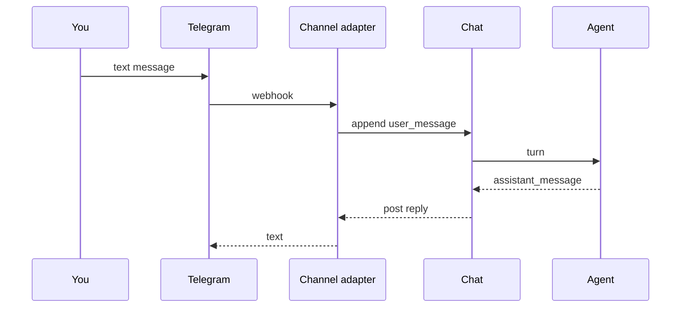

## Goal

A Telegram bot you DM to. Each new conversation creates (or
resumes) a chat thread bound to your private agent. Useful for
reminders, quick research, and durable to-do lists.

## The dispatch chain



## Steps

Create a Telegram bot via @BotFather, then attach it as a
channel provider:

```code-tabs:python
--- python
prov = client.channels.create_provider(
    kind="telegram",
    name="my-personal-bot",
    config={"bot_token": "1234567890:ABC-..."},
)
chan = client.channels.create(
    provider_id=prov.id,
    channel_id="987654321",  # your own user id from @userinfobot
    name="personal-dm",
)
```

Create the agent and bind it to the chat channel:

```code-tabs:python
--- python
agent = client.agents.create(
    name="personal-assistant",
    model="claude-sonnet-4-6",
    toolsets=["system", "web", "misc"],
    system_prompt=(
        "You are a personal assistant. Be concise. Track to-do "
        "items the user mentions in the persistent chat memory."
    ),
)
client.channels.associate(agent_id=agent.id, channel_id=chan.id)
```

```callout:info
The chat thread persists across messages because the channel
adapter keeps a per-user chat id. Your second message lands in
the same chat as your first; the agent sees the full
transcript.
```

## Verification

In Telegram, DM the bot. The first message creates a chat in
the Chats page; the reply streams back as the agent thinks.

```mockup:chat-stream
{ "chatId": "tg-chat-001", "streaming": false, "userName": "you", "agentName": "personal-assistant" }
```

## Gotchas

```callout:warning
Telegram bots see every message in groups they are added to,
not just direct messages. If you want the bot to ignore group
mentions, bind it to a single private chat id rather than the
group's channel id.
```

- Telegram caches the bot's profile picture aggressively;
  changing the avatar may take a few hours to propagate.
- Long agent responses get split into multiple Telegram
  messages at the 4096 character mark; the channel adapter
  handles the split automatically.
