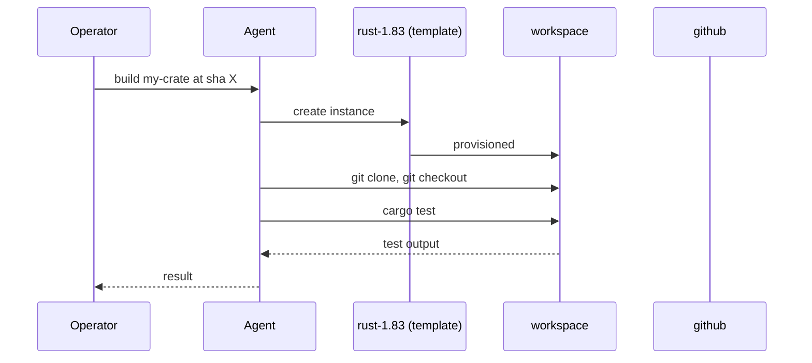

## Goal

Treat the workspace as a one-shot build environment. An agent
spins up a workspace from a Rust toolchain template, clones the
target repo, runs `cargo test`, and reports the result.

## The dispatch chain



## Steps

Define the workspace template:

```code-tabs:bash,python
--- bash
# Create the rust-1.83 template from the harness that ships it,
# or hand-build via the API:
uv run primer harness install \
  --source https://github.com/codemug/harness-rust-build
--- python
client.workspaces.create_template(
    provider_id="docker",
    name="rust-1.83",
    base_image="rust:1.83-slim",
    ttl_minutes=15,
    env={"CARGO_TERM_COLOR": "never"},
    post_create_commands=[
        "apt-get update && apt-get install -y git",
    ],
)
```

The agent invocation:

```code-tabs:python
--- python
sess = client.sessions.create(
    agent_id="rust-builder",
    input={
        "repo": "https://github.com/codemug/my-crate",
        "sha": "abc123",
    },
)
```

```callout:tip
Set the template TTL just longer than a typical build. Too short
and your build dies; too long and idle workspaces accumulate
between runs.
```

## Verification

The session detail page shows the agent's transcript including
the `cargo test` output. A successful build looks like:

```mockup:session-detail-panel
{ "sessionId": "sess-build-001", "agentId": "rust-builder", "status": "done", "turnCount": 5 }
```

## Gotchas

```callout:warning
The docker provider runs builds in containers; resource caps
(CPU, memory) come from the template. A build that needs more
memory than the template allows OOM-kills silently and the
agent sees a truncated test output. Match the caps to the
heaviest crate you build.
```

- Workspace network egress is provider-dependent; the local
  provider has full egress, docker depends on the daemon
  config, kubernetes follows the NetworkPolicy.
- For repeatable builds, pin the Rust toolchain via
  `rust-toolchain.toml` rather than the template base image.
