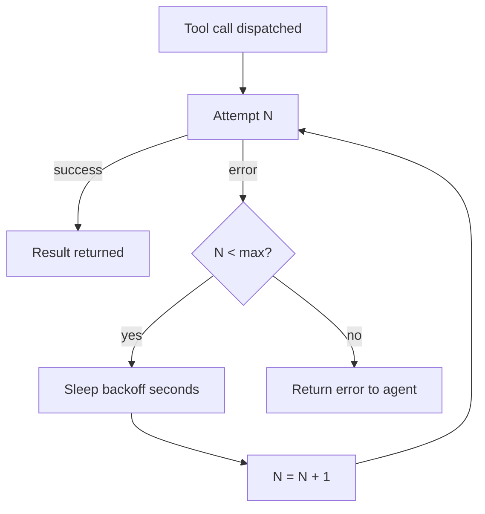

## Beyond the basics

The `features/agents` walkthrough covers the create modal and a
first invocation. This page covers what you reach for on day two:
swapping models without rewriting prompts, prompt templates that
fan out to multiple agents, fine-grained binding rules, and what
the retry knobs actually control.

## Model selection

Every agent declares one model. Switching the model is an in-place
update: hit Edit, pick a new model, save. Sessions started after
the switch use the new model; in-flight sessions keep the old one
until they complete.

```callout:tip
For routine work, prefer the smallest model that produces the
output you accept. The cost difference between Opus and Haiku for
the same agent is roughly 12x. Reserve the big models for
prompts where the agent visibly struggles to follow instructions.
```

## Prompt templating

The system prompt accepts Jinja-style placeholders that resolve
against the session's input metadata. The common ones:

| Placeholder | Resolves to |
|---|---|
| `{{ agent.name }}` | The agent's name |
| `{{ session.workspace_id }}` | The workspace id this session runs in |
| `{{ session.input }}` | The initial input string |
| `{{ now }}` | Current ISO timestamp |

The prompt tab in the create modal renders the template against
sample inputs so you see the resolved text before saving.

```mockup:agent-create-modal
{ "tab": "prompt" }
```

## Fine-grained tool binding

Binding a toolset gives the agent every tool in it. Sometimes that
is too broad. Two ways to narrow:

- **Per-tool overrides**: in the toolset binding row, mark
  specific tools as denied. Useful for keeping the agent off
  `delete_*` operations while granting the rest of `system`.
- **Tool approval policies**: set a policy on the specific
  `(toolset, tool)` pair so the call routes to an approval gate.

The two compose. A tool can be bound, then approval-policied, then
silently denied for an emergency override; the agent sees a clean
error from the deny, and the approval queue records the attempt.

## The retry loop

When a tool call errors, the agent sees the error and decides
what to do next. The runtime adds two knobs:

```code-tabs:python,curl,javascript
--- python
client.agents.update(
    agent_id="weekly-digest",
    retry_policy={
        "max_attempts": 3,
        "backoff_seconds": 2,
    },
)
--- curl
curl -X PATCH https://primer.example/v1/agents/weekly-digest \
  -H "Authorization: Bearer $TOKEN" \
  -d '{"retry_policy":{"max_attempts":3,"backoff_seconds":2}}'
--- javascript
await fetch("/v1/agents/weekly-digest", {
  method: "PATCH",
  headers: { "Authorization": `Bearer ${token}` },
  body: JSON.stringify({ retry_policy: { max_attempts: 3, backoff_seconds: 2 } }),
});
```



## Evaluations

Agents can be invoked in eval mode against a fixture set. The
result is a per-fixture pass/fail and a score for the response.
Use this when tuning a prompt to verify the change does not
regress an earlier scenario.

```callout:tip
Pin eval fixtures to a git commit. A prompt change that improves
one scenario often regresses another; running the full suite
before promoting keeps the surprise rate down.
```
