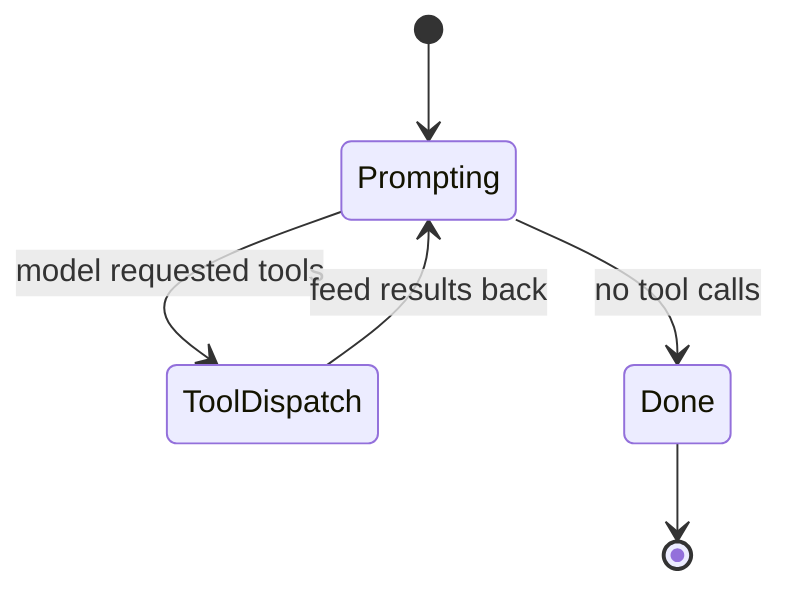

## Overview

The Agents page in the console lists every defined agent with its
model and toolset bindings. The Create button opens the
three-tab modal that walks you through basics, tools, and the
system prompt.

## Creating an agent

The create modal opens with the Basic tab focused. Switching to
the Tools tab shows the toolset picker:

```mockup:agent-create-modal
{ "tab": "tools", "selectedToolset": "system" }
```

Bind whichever built-in or custom toolsets the agent should be able
to call. The agent can only reach tools from the toolsets bound
here; everything else is denied at dispatch time.

```callout:warning
Binding the `system` toolset gives the agent shell and filesystem
access through the sandboxed workspace. Pair it with a tight
workspace template (small memory, no network, short TTL) when
prototyping; relax once you trust the prompt.
```

## The turn loop, in detail

Each invocation of the agent runs through the same loop. The
diagram below shows the four states a turn passes through:



## Invoking via REST

The console UI sits on top of `/v1/agents`. Anything you do in the
modal is replayable via the API.

```code-tabs:python,curl,javascript
--- python
import primer
client = primer.Client(token="...")
agent = client.agents.create(
    name="weekly-digest",
    model="claude-opus-4-7",
    toolsets=["system", "web"],
)
print(agent.id)
--- curl
curl -X POST https://primer.example/v1/agents \
  -H "Authorization: Bearer $TOKEN" \
  -H "Content-Type: application/json" \
  -d '{"name":"weekly-digest","model":"claude-opus-4-7","toolsets":["system","web"]}'
--- javascript
const r = await fetch("/v1/agents", {
  method: "POST",
  headers: { "Authorization": `Bearer ${token}`, "Content-Type": "application/json" },
  body: JSON.stringify({ name: "weekly-digest", model: "claude-opus-4-7", toolsets: ["system", "web"] }),
});
console.log((await r.json()).id);
```

## Going further

For model selection, prompt templates, fine-grained binding, the
retry loop, and evaluations:

```ref:features/agents-advanced
The advanced page covers what you reach for once the basic flow
works.
```

## Agent-facing reference

For the dense MCP-tool view used by LLM agents, follow the link
below. It mirrors the same content with terser prose.

```ai-doc:agents
```
