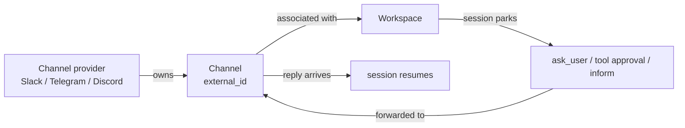

## What a channel is

A channel is a specific conversational room on a messaging platform: a Slack channel ID, a Telegram chat ID, or a Discord channel snowflake. It belongs to a channel provider (the credential set for the platform) and carries two responsibilities:

- **Session gate forwarding.** When a workspace session parks on `ask_user`, a tool approval request, or an `inform_user` call, primer forwards the prompt to the channel the workspace is associated with. The human responds in Slack, Telegram, or Discord, and the session resumes without anyone touching the primer console.
- **Chat surface.** When chat is enabled on a channel, incoming messages from that room start or continue primer chats, so an agent can hold a full conversation with a user over the messaging platform.

Both responsibilities run on the same room object. You configure which one you want (or both) through the channel's settings.

Three objects work together:

- **Channel provider**: credentials for one platform (one Slack app, one Telegram bot, one Discord bot). See the channel providers page for setup.
- **Channel**: a room inside a provider, identified by its external ID on the platform.
- **Workspace channel association**: binds a workspace to a channel so that workspace's session gates forward there.



## Configuration

Each channel has the following fields:

| Field | Required | Notes |
|---|---|---|
| Provider | yes | The channel provider this room belongs to. Locked after creation. |
| External ID | yes | The platform's room identifier (Slack channel ID like `C0123ABC456`, Telegram numeric chat ID, Discord channel snowflake). |
| Label | no | A human-readable name (up to 200 characters, e.g. `#ops-alerts`). Shown in the console in place of the external ID. |
| Chat config | no | Controls whether incoming messages start primer chats. See below. |

### Chat settings

Chat settings live on the channel and control the chat surface for that room:

| Setting | Default | Notes |
|---|---|---|
| `enabled` | false | When true, messages in this room can start or continue primer chats. |
| `default_agent` | none | The agent each new chat starts with. Required when `enabled` is true. |
| `allow_agent_switch` | false | Whether users may run `/agent` to switch the chat to a different agent. Off by default. |
| `allowed_agents` | (any) | When agent switching is on, restricts `/agent` to this list. Empty means any agent is allowed. |
| `relay_mode` | `final` | Controls outbound verbosity. `final` posts only the assistant's last message; `all` posts every streaming chunk. |

## Walkthrough: add a channel

1. Confirm a provider exists. Open **Channels** in the sidebar and check the **Providers** tab. Create a provider first if none is listed.
2. Switch to the **Channels** tab.
3. Click **New channel**.
4. Select the **provider** the channel belongs to. This field is locked after creation.
5. Enter the **external ID** of the room:
   - Slack: channel ID (e.g. `C0123ABC456`). Find it in Slack by right-clicking the channel name and choosing "Copy link" or "Copy Channel ID".
   - Telegram: chat ID (numeric). You can obtain it by messaging `@userinfobot` or from the bot's `getUpdates` response.
   - Discord: channel snowflake. Right-click the channel in Discord (with Developer Mode on) and choose "Copy Channel ID".
6. Optionally enter a **label** for display.
7. Set chat settings if you want the room to drive chats (toggle **enabled**, pick a **default agent**).
8. Click **Create channel**.

After creating the channel, associate it with a workspace if you want session gates to forward there. See the channel-workspace association page.

## In-channel commands

When chat is enabled on a room, users can type slash commands to manage their conversations. Which commands are available depends on whether the platform supports threads:

**Thread-based platforms (Slack, Discord):** Each thread is a separate chat, so `/new`, `/list`, and `/switch` are unnecessary. Only `/agent` and `/help` are offered.

**Single-thread platform (Telegram):** Telegram has no threads, so all four chat-management commands are available.

| Command | Platforms | What it does |
|---|---|---|
| `/new` | Telegram | Start a fresh chat with the default agent. |
| `/list` | Telegram | List existing chats on this channel. |
| `/switch <chat-id>` | Telegram | Switch the active chat to a previous one. |
| `/agent` | All | Pick a different agent for the current chat (only if `allow_agent_switch` is on). |
| `/help` | All | Show the available commands. |

## Multimedia

Channels support inbound and outbound media:

- **Inbound:** photos, documents, and audio sent by users arrive as media parts attached to the chat message. The agent can process them.
- **Outbound:** media produced by tools (files written to a workspace, images returned from a tool result) are forwarded to the channel when the session gate fires.


```ref:features/channel-providers
Set up the provider credentials before creating channels.
```

```ref:features/channel-workspace-association
Bind a channel to a workspace and understand the full inbound/outbound flow.
```

```ref:features/chats
How chat turns work and the agent switcher.
```

```ref:reference/api-channels
Full REST schema for channels and workspace association.
```
