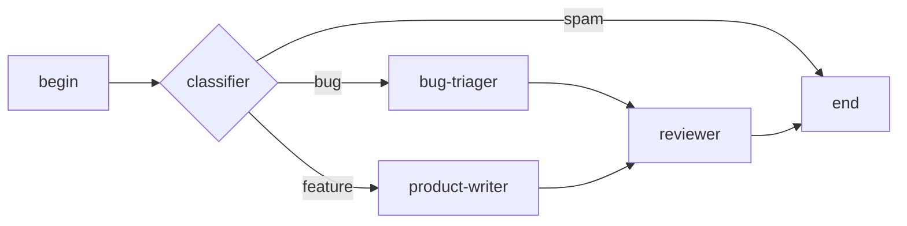

## What graphs are for

A graph wires several agents (or several invocations of the same
agent) into a multi-step workflow. Each node is an agent
invocation with its own prompt and toolset bindings. Edges carry
the output of one node into the input of the next. Conditional
edges let the graph branch based on a tool result or a model
output.

Use a graph when the work splits cleanly into stages: research,
critique, write; or fetch, classify, dispatch. Use a single agent
when the work is one continuous conversation.

## A three-node graph

The simplest useful graph has three nodes in a line: a begin, a
worker, an end. The console graph designer renders it like this:

```mockup:graph-canvas-three-nodes
{ "selected": "agent" }
```

The `begin` node receives the initial input. The `agent` node
runs the work. The `end` node accepts the final output. Real
graphs add more nodes between; the shape stays the same.

## Topology

Graphs are directed acyclic by construction; conditional edges
let a node fan out to several downstream nodes but the runtime
forbids cycles to keep termination provable.



## Dispatching from the REST API

The console's graph designer is the easiest entry point. Once a
graph is defined the REST surface is symmetric to sessions:

```code-tabs:python,curl
--- python
run = client.graphs.run(
    graph_id="incident-pipeline",
    input={"alert": payload},
)
print(run.id, run.status)
--- curl
curl -X POST https://primer.example/v1/graphs/incident-pipeline/runs \
  -H "Authorization: Bearer $TOKEN" \
  -H "Content-Type: application/json" \
  -d '{"input":{"alert":"..."}}'
```

A graph run produces one session per node. The run id pins them
all together so the operator can see the whole pipeline at once
on the graph run detail page.

## Pitfalls

```callout:warning
Graph runs share workspace state when the same workspace is bound
to multiple nodes. That is sometimes what you want (later nodes
read files written by earlier ones) and sometimes not (two
parallel nodes step on each other). Either bind distinct
workspaces or serialise the offending nodes.
```

```ref:concepts/sessions
Every node in a graph run is a session; the session concept page
covers what state lives where.
```
