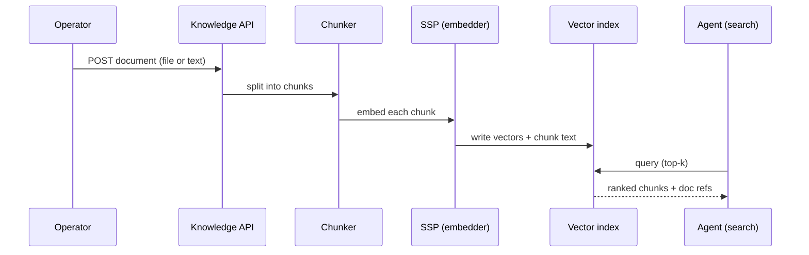

## The document lifecycle

A document lives inside a collection. From the moment it lands
to the moment an agent reads it, it moves through four stages.



The four stages run synchronously by default for small files and
asynchronously (background worker) for large ones. The document
record carries the `status` field so the operator can see where
in the pipeline a slow ingest is.

## Adding a document

Two transports. The console drag-and-drop and the REST POST are
equivalent.

```code-tabs:python,curl
--- python
doc = client.knowledge.put_document(
    collection_id="incident-runbooks",
    file=open("post-mortem-2026-05.md", "rb"),
    metadata={"source": "internal", "year": 2026},
)
print(doc.id, doc.status)
--- curl
curl -X POST https://primer.example/v1/knowledge/collections/incident-runbooks/documents \
  -H "Authorization: Bearer $TOKEN" \
  -F "file=@post-mortem-2026-05.md" \
  -F 'metadata={"source":"internal","year":2026}'
```

## Metadata schema

The `metadata` field on a document is free-form JSON. Agents see
it on every retrieval. Common patterns:

| Field | Use |
|---|---|
| `source` | Where the document came from (internal, vendor, etc.) |
| `tags` | Free-text filter terms |
| `confidence` | How authoritative this document is |
| `created_at` | When the underlying content was authored |
| `expires_at` | When the operator wants this auto-dropped |

The agent can filter retrievals on metadata in the search call,
so good metadata pays for itself the first time you need to
restrict to recent material.

## Re-indexing

Re-ingest is required when the chunking strategy or the SSP
changes. The collection-level re-index endpoint walks every
document in the collection and runs each through the new
pipeline.

```callout:warning
A re-index is not cheap. For a collection with ~1k documents and
a remote embedding API, expect the better part of an hour and a
visible bill from the SSP. Re-index off-peak; the API does not
throttle you on your behalf.
```

## Update vs delete

Two ways to remove stale content:

- **Delete** drops the document and its chunks immediately.
  Reversible only from a backup.
- **Update** replaces the document content while keeping the id.
  Old chunks are dropped; new chunks are embedded; the
  collection picks up the change atomically.

Use update when an external source produces revisions you want
to track; use delete for actual retraction.
