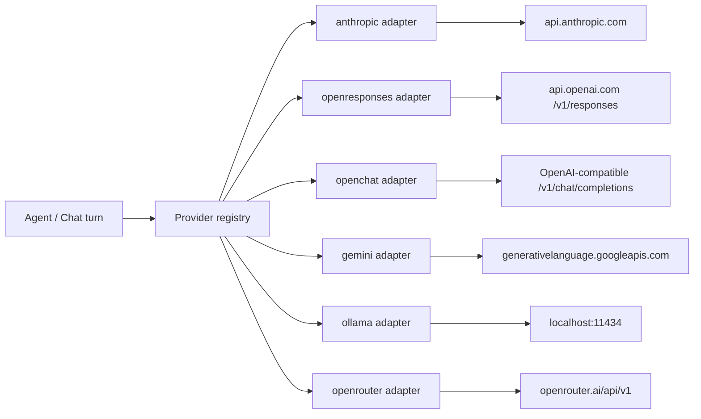

## Concept

An LLM provider is a named connection from primer to a chat or completion backend. Every agent and chat turn in primer routes through exactly one provider row; the row tells primer which API to call, how to authenticate, which model identifiers are allowed, and how many concurrent requests are permitted at once.

Primer uses a provider-pattern: adapters for each backend implement a shared streaming interface, so the agent loop never imports a vendor SDK directly. A provider row is just configuration (one entry in the registry), and the adapter is built from it lazily when a first turn arrives. Editing a row rebuilds the adapter without restarting the server.

Six LLM provider types ship today:

- **anthropic**: Anthropic's Messages API (Claude family).
- **openresponses**: the OpenAI Responses API (`/v1/responses`). Targets the stateful, multi-turn Responses surface rather than the legacy Chat Completions endpoint.
- **openchat**: the legacy OpenAI Chat Completions API (`/v1/chat/completions`). Use this for OpenAI itself, LM Studio, vLLM, and other OpenAI-compatible servers.
- **gemini**: Google Gemini via the Gemini API (Google AI Studio). Uses a single API key; Vertex AI is a separate provider type if needed.
- **ollama**: a local or remote Ollama HTTP server. No API key required by default.
- **openrouter**: OpenRouter, a gateway in front of many upstream providers (Anthropic, OpenAI, Google, Mistral, and others). Exposes an OpenAI-compatible `/chat/completions` endpoint with a single key.



## Configuration

Every LLM provider row has these fields:

### Provider type

Selects the backend adapter. Choose from `anthropic`, `openresponses`, `openchat`, `gemini`, `ollama`, or `openrouter`. This determines which connection fields appear below.

### Provider ID

A unique handle you choose, for example `anthropic-prod` or `openrouter-free`. Agents and chats reference this ID when selecting a provider.

### Connection fields (per type)

**anthropic**
- `api_key`: your Anthropic API key. Optional at the schema level (leave unset when a proxy injects auth), but required for direct access to `api.anthropic.com`.

**openresponses**
- `url`: base URL of the OpenAI-compatible Responses API endpoint (e.g. `https://api.openai.com`).
- `api_key`: bearer token. Optional for unauthenticated endpoints like a self-hosted proxy.
- `flavor`: server variant: `openai` (real OpenAI), `lmstudio` (LM Studio quirk handling), or `other` (conservative defaults). Defaults to `other`.

**openchat**
- `url`: base URL of the Chat Completions endpoint.
- `api_key`: bearer token. Optional for unauthenticated endpoints.
- `flavor`: server variant: `openai`, `lmstudio`, `ollama`, `vllm`, or `other`. Defaults to `other`.

**gemini**
- `api_key`: Gemini API key from Google AI Studio. Optional when fronted by a proxy that supplies auth.

**ollama**
- `url`: base URL of the Ollama server (e.g. `http://localhost:11434`).
- `api_key`: optional bearer token. Only needed when running Ollama behind a reverse proxy with its own auth.

**openrouter**
- `api_key`: OpenRouter API key. Required (OpenRouter is always remote and always authenticated).
- `app_name`: optional. Sent as the `X-Title` header for attribution on the OpenRouter leaderboard.
- `app_url`: optional. Sent as the `HTTP-Referer` header for attribution.

### Models

A list of model identifiers the provider is allowed to serve. Each entry has:

- `name`: the provider-side model slug (e.g. `claude-opus-4-5`, `gpt-4o-mini`, `meta-llama/llama-3.1-8b-instruct:free`). Agents that request a model not in this list receive a `ModelNotFoundError`.
- `context_length`: the maximum token budget the model accepts per request. Primer uses this for capacity planning but does not enforce it directly; the upstream provider enforces its own limit.

Use **Discover models** (available for Ollama and OpenRouter) to populate this list automatically from the upstream catalogue.

### Limits

- `max_concurrency`: maximum number of in-flight requests primer will send to this provider at once. When the cap is reached, additional requests queue until a slot opens. Set this to match your API tier's rate limits; a value that is too high causes upstream 429s, while a value that is too low wastes throughput. There is no default; you must choose a value.
- `request_timeout_seconds`: per-event inactivity timeout for streaming calls (default: `300`). If no token arrives within this window the stream is aborted with a timeout error and the concurrency slot is released cleanly. This is a stall timeout; a response that is actively producing tokens will not be cut off. Set to a lower value (e.g. `60`) for faster failure detection on small models or fast hardware. Set to `null` to disable the timeout entirely.

## Walkthrough

The following steps add an OpenRouter provider as an example. Steps are the same for all types; only the connection fields differ.

1. Go to **Providers** in the left navigation and open the **LLM** tab.
2. Click **Add provider**.
3. Set **Provider type** to `openrouter`.
4. Enter a provider ID such as `openrouter-free`.
5. Paste your OpenRouter API key into the `api_key` field. The base URL is hard-coded and pre-filled.
6. Optionally fill in `app_name` so your usage shows up on the OpenRouter leaderboard.
7. Click **Discover models** to fetch the current catalogue. Choose one or more models from the list (for a free tier, look for the `:free` suffix, such as `meta-llama/llama-3.1-8b-instruct:free`).
8. Set `max_concurrency` to match your plan; `5` is a safe starting point for a free key.
9. Leave `request_timeout_seconds` at the default `300` unless you have a reason to change it.
10. Click **Save**.

```embed:llm-provider-openrouter
```

```callout:tip
For Anthropic, the console falls back to a curated suggested-model list because Anthropic has no list-models API. Type the model slug directly (e.g. `claude-opus-4-5`) rather than using Discover models.
```

## What happens after

Once a provider row is saved, primer caches an adapter for it. From that point:

- Agents can reference the provider by ID when selecting which LLM to use for a turn.
- Chats can select the provider through the chat configuration or the agent assigned to the chat.
- If you edit the provider row (change the API key, add a model, adjust limits), primer rebuilds the adapter automatically without restarting.
- Deleting a provider row drops the cached adapter and releases its HTTP connection pool.

```ref:features/agents
How to wire an agent to a specific provider and model.
```

```ref:features/chats
How the chat composer selects a provider via its agent.
```

```ref:reference/api-providers
Provider CRUD endpoints and the model-discovery endpoint.
```
