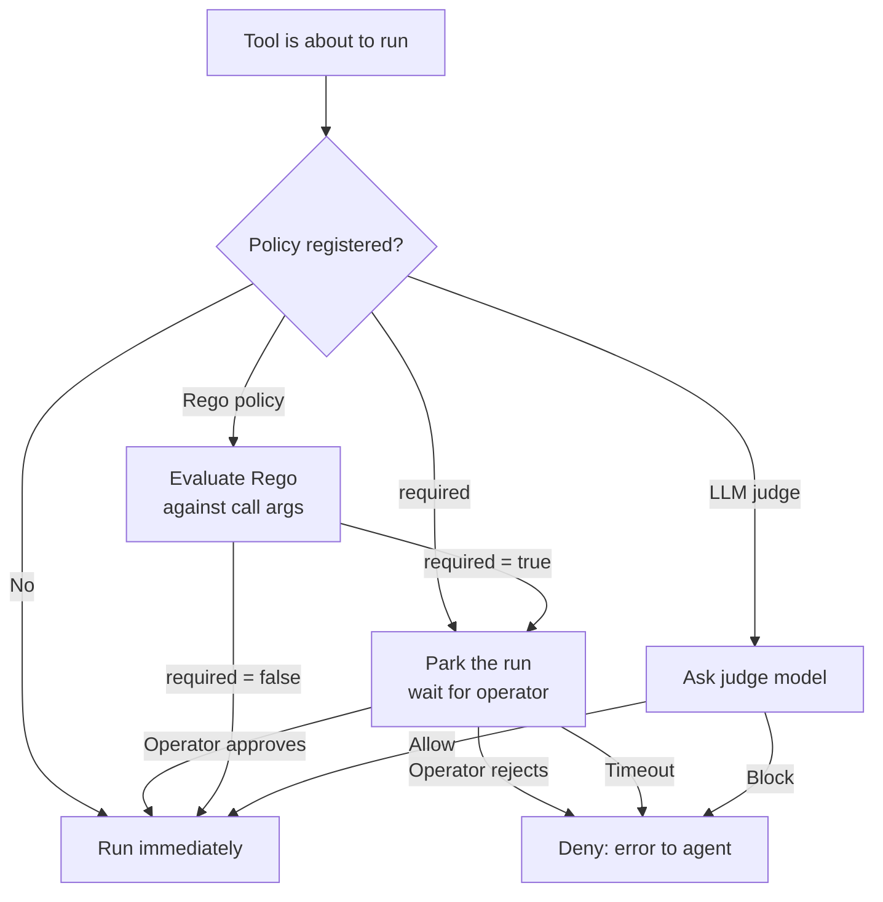

## Concept

Tool approval is a pre-dispatch gate. Every time a tool is about to run, primer checks whether a policy has been registered for that `(toolset_id, tool_name)` pair. When no policy exists the tool runs immediately. When a policy exists, it becomes the decision-maker: should this particular call proceed or be denied?

The gate is not the same as removing a tool from an agent. The tool remains available to the agent's model; approval decides, call by call, whether execution is permitted. A single policy can allow most calls and block only the ones that match a specific condition.

Mechanically, a blocked call parks the run the same way a yielding tool does. The worker releases its capacity lease, freeing compute, and the run stays in storage until the gate resolves. If no resolution arrives within the configured timeout the gate closes and the call is treated as denied.

### The three approval strategies

Primer provides three strategies. A policy row picks exactly one.

**Required.** The gate always waits for a human operator to respond. The pending call is surfaced so the operator can see what tool is about to run, which arguments it was given, and which agent and session triggered it. The operator approves or rejects. Approved calls execute; rejected calls produce a clean error that the agent can reason about. No automated path can bypass a required gate.

**Rego policy.** A small Open Policy Agent policy, written in Rego and stored with the policy row, evaluates the call arguments against the call context. The policy must produce a single boolean result: `required := true` means gate and wait; `required := false` means allow immediately. The evaluation is deterministic and synchronous. No human is involved unless the policy routes to a required gate. For example, a policy that gates only calls whose arguments include a sensitive flag will allow all other calls to pass without delay.

**LLM judge.** A designated model evaluates a judge prompt describing the call and returns allow or block with a short reason. This strategy is probabilistic: the same call could produce different outcomes across runs. The judge's decision and its reason are recorded on the pending approval row so operators can audit why a call was allowed or blocked.

### Decision flow



### Approval and MCP

When primer acts as an MCP server, it re-checks the approval policy on every `tools/call` request -- the same engine used by the agent/session path. If a tool's effective policy resolves to `required`, the call is **refused** rather than dispatched. This is an intentional hard boundary: the MCP v1 protocol has no park-and-resume surface where a human or judge can weigh in, so dispatching the call would silently bypass the gate the operator configured. The tool returns a `not_exposed` error with reason `approval_required`. The operator must either remove the policy, change it to Rego or LLM-judge so it can resolve without a human, or invoke the tool via a session where the gate can park and wait.

### Policy lifecycle

Policies are additive and reversible. A policy can be disabled without deleting it, which restores the tool to immediate dispatch. Re-enabling reinstates the gate on the next call. Deleting removes the gate entirely. None of these changes require a restart, and none affect calls that are already parked -- those resolve under the policy that was in effect when they parked.

## Configuration

```embed:approvals
```

The Approvals page has two tabs: **Pending** and **Policies**. Policies define when a tool call must stop and wait for a decision. Pending shows every parked tool call waiting for a response right now. The page polls automatically every five seconds.

### Creating a policy

1. Open **Approvals** in the left nav and click the **Policies** tab.
2. Click **New policy** (top-right of the tab bar).
3. In the modal, pick an approval type:

   | Type | Behavior |
   |---|---|
   | Required | Every call parks and waits for a manual decision. |
   | Policy (Rego) | A Rego rule runs against the call; `required = true` triggers a hold. |
   | LLM judge | A configured LLM provider evaluates a judge prompt; the model decides. |

4. Enter a unique **id** for this policy (for example, `approve-stripe-refund`).
5. Pick the **toolset** from the dropdown or type a custom toolset id.
6. Enter the **tool name** (for example, `delete_agent`).
7. Optionally set a **timeout** in seconds. If omitted, the global yield cap applies.
8. For **Policy (Rego)**, paste your Rego into the editor. The policy must define a `required` boolean. A starter template is pre-filled.
9. For **LLM judge**, select a provider and model (from those already configured under LLM Providers), then write the judge prompt. The call context is appended as the user message.
10. Click **Create policy**. The new row appears in the Policies table with the toggle enabled.

### Editing or disabling a policy

In the Policies table each row has an **edit** (pencil) button and a **delete** (trash) button. Click edit to reopen the modal with all fields pre-filled. The **id** field is locked after creation; every other field is editable. Use the **Enabled** toggle in the row to pause a policy without deleting it.

```callout:warning
Deleting a policy that currently has parked sessions does not auto-resolve those sessions. The parked calls stay parked until you decide them manually, then the session continues.
```

## Walkthrough -- gate a destructive system tool

This walkthrough puts a required approval on `system__delete_agent` so no agent can delete another agent without an operator sign-off.

1. Open **Approvals** and go to the **Policies** tab.
2. Click **New policy**.
3. Set **id** to `guard-delete-agent`, **type** to `Required`, **toolset** to `system`, **tool name** to `delete_agent`.
4. Set **timeout** to `3600` (one hour) so parked calls do not block indefinitely.
5. Click **Create policy**.

Now, the next time any agent calls `system__delete_agent`:

1. The call parks. The agent's turn pauses.
2. The call appears on the **Pending** tab.
3. You review the call arguments (which agent id is about to be deleted, which session triggered the call).
4. Click **Approve** to release the call -- the session resumes and the delete executes.
5. Or click **Reject**, type a reason, and click **Send rejection**. The agent receives a clean error and can decide how to proceed.

The amber banner in the session or chat detail view also shows the Approve and Reject controls while the call is parked.

### Walkthrough -- allow most calls, gate one

This walkthrough uses a Rego policy to gate only calls that target a specific workspace, while letting all other calls through.

1. Create a new policy with **type = Policy (Rego)** and **toolset = workspaces**, **tool name = exec**.
2. In the Rego editor, write a policy like:

   ```rego
   package primer.approval

   # Gate exec calls targeting the production workspace.
   required := input.arguments.workspace_id == "prod-workspace"
   ```

3. Save. Now `workspaces__exec` calls targeting `prod-workspace` park for operator approval; calls to any other workspace pass through immediately.

```callout:danger
Rejecting a tool call is not a retry. The agent receives an error message. If the agent's system prompt does not anticipate a rejection it may stall or end unexpectedly. Test the reject path in a development session before enabling a required policy in production.
```

## What happens after

- Each new policy takes effect on the very next matching tool call. No restart needed.
- A `required` policy on a tool that is also allowlisted in the MCP server endpoint means that tool will be refused over MCP (`reason="approval_required"`). Change the strategy to Rego or LLM-judge if you need MCP callers to use the tool.
- The pending call record exposes the full arguments the agent passed, plus the toolset, tool, agent, and session ids. This gives the operator enough context to make an informed decision without leaving the console.
- Rego policies fail closed: a bug or syntax error in the policy body causes the gate to treat the call as `required` (human review required) rather than silently allowing it. The same fail-closed behaviour applies to LLM-judge verdicts -- a failed judge call blocks the tool.
- Approval policies compose with binding. Binding controls what the agent can request; approval controls what actually executes. An agent cannot request a tool it was not bound to, and cannot execute one that an approval gate blocks.

```ref:features/toolsets-system
The seven built-in toolsets and the tools they contain.
```

```ref:features/mcp-server
Primer as an MCP server -- how allowlist and approval combine to control what external clients can call.
```
