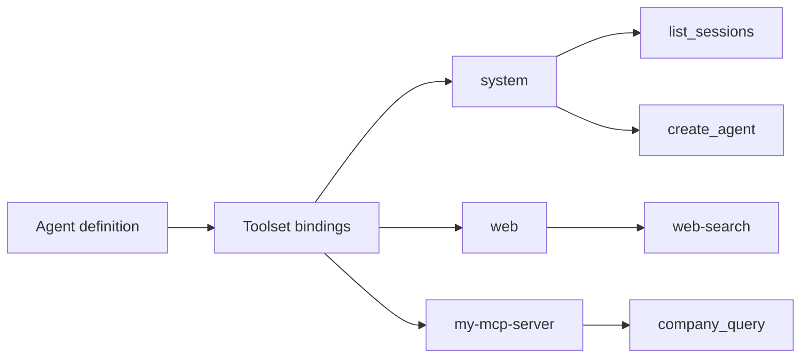

## Concept

A **tool** is a single callable function (`read_file`, `web_search`, `list_sessions`). A **toolset** is a named collection of related tools: `system`, `web`, `workspaces`, `misc`.

The two levels serve different roles:

- An agent is bound to **toolsets**. Binding a toolset grants the agent access to every tool inside it.
- An agent can also declare individual **tool ids** to restrict its context to a subset of a toolset's tools.

This split matters because context size matters. An agent bound to only the tools it needs exposes a smaller, cleaner schema to the model than one that carries the entire platform surface. Toolsets answer the question "what kind of work can this agent do?" (browse the web, manage sessions, read workspace files). Individual tool ids answer "which exact actions within that kind?" (only read, not write).

### How binding gates what an agent can call

At session start, primer assembles the agent's effective tool list from its bindings. Only the tools in that list are presented to the model; the rest of the platform surface is invisible to it. An agent cannot call a tool it was not bound to, regardless of how it phrases the request.



Binding determines what the agent can request. The approval layer (a separate mechanism) determines what actually executes.

### The seven reserved toolsets

Primer ships seven built-in toolsets that are always available without registration. They are reserved by id; you cannot create a user toolset with the same id.

| Toolset | What it covers |
|---|---|
| `system` | Full CRUD over every platform entity (agents, graphs, collections, providers, toolsets, channels, workspaces, triggers, approval policies). Plus meta-tools: `list_toolset_tools`, `call_tool`, `invoke_agent`, `switch_to_agent`. |
| `web` | Web search (`web-search`), raw HTTP fetch (`web-fetch`, `http-request`). Requires a web search provider to be configured for `web-search`. |
| `workspaces` | Read, write, edit, glob, grep, and exec within a workspace sandbox. |
| `misc` | Portable stateless utilities: `get_datetime`, `sleep`, `ask_user`, `inform_user`, `uuid_v4`, `hash`, `calculate`. |
| `search` | Semantic search over internal collections: `search_agents`, `search_graphs`, `search_collections`, `search_tools`, `search_ai_docs`. Active only when the internal collections subsystem is bootstrapped. |
| `trigger` | Manage triggers and subscriptions. Includes the yielding tool `subscribe_to_trigger`, which parks the calling session until a trigger fires. |
| `harness` | Lifecycle management for harnesses (`harness__list`, `harness__get`, `harness__register`, `harness__fetch`, `harness__install`, `harness__sync`, `harness__uninstall`, `harness__update`, `harness__update_overrides`). |

### Yielding tools

Several built-in tools are marked as **yielding**: when called, they park the run and release the worker rather than blocking. The worker picks up the session again when the triggering event arrives. Yielding tools require a workspace session (they do not work in chat-only contexts, with the exception of `ask_user` which degrades to a conversational turn on a chat surface).

Key yielding tools:

| Tool | Yields on |
|---|---|
| `misc__sleep` | A timer event after N seconds |
| `misc__ask_user` | An operator reply via the pending questions queue |
| `trigger__subscribe_to_trigger` | The named trigger firing |
| `system__switch_to_agent` | Chat-only: hands the conversation off to another agent |

### Exploring the tool catalog from an agent

Two meta-tools in the `system` toolset let an agent discover and call any tool at runtime without carrying the full catalog in its context:

- **`system__list_toolset_tools`**: enumerate every tool a given toolset exposes, including its arguments schema and description. Call this on an unfamiliar toolset before dispatching to it.
- **`system__call_tool`**: meta-dispatch: invoke any tool from any toolset by toolset id and tool name, forwarding arguments directly. The dispatched tool's output and error status are passed through unchanged.

This is the **search-and-invoke pattern**: an agent searches for a tool by description via `search__search_tools`, finds the right one, then calls it through `system__call_tool`, all without its prompt carrying every tool definition up front.

## Configuration

Toolset bindings are set on the agent, not on the toolset itself. The toolset just exists; the agent declares which toolsets it uses.

```embed:toolsets
```

### Binding toolsets

1. Open **Agents** in the left nav.
2. Click the agent you want to configure, or click **New agent**.
3. Go to the **Tools** tab.
4. Use the toolset selector to add one or more toolsets. The selector shows all registered toolsets (built-in and MCP).
5. Optionally, after adding a toolset, expand it and check individual tool ids to restrict the agent to a subset. Leaving the list empty means "all tools in this toolset."
6. Click **Save**.

### Tool id syntax

When referencing a tool by its full scoped id (for example, in MCP exposure allowlists or policy configurations), the convention is `toolset_id__tool_name`, using double underscores as a separator; for example `system__invoke_agent`, `misc__ask_user`, `search__search_agents`.

The `web` toolset uses hyphens in its bare tool names (`web-search`, `web-fetch`, `http-request`), so their scoped ids are `web__web-search`, `web__web-fetch`, `web__http-request`.

## Walkthrough: explore a toolset from the console

This walkthrough discovers what tools the `misc` toolset exposes, then calls one of them through a running agent.

1. Open **Agents** and open or create an agent that has the `system` toolset bound to it.
2. Start a new **session** or **chat** with that agent.
3. Ask the agent: "Use `list_toolset_tools` to show me the tools in the `misc` toolset."
4. The agent calls `system__list_toolset_tools` with `{"toolset_id": "misc"}` and returns the tool list including `get_datetime`, `sleep`, `ask_user`, `uuid_v4`, `hash`, and `calculate`.
5. Ask: "Now call `get_datetime` for me." The agent calls `system__call_tool` with `{"toolset_id": "misc", "tool_name": "get_datetime", "arguments": {}}` and returns the current timestamp.

The same pattern works for any registered toolset, built-in or MCP.

## What happens after

Once toolsets are bound:

- The agent's system prompt sees only the bound tools' schemas. A `system` binding exposes roughly 75 tools covering all platform entities; binding only the subset you need keeps the context smaller.
- The `search` toolset becomes available as soon as internal collections are bootstrapped (a one-time setup step in Settings). Until then, its tools return a `subsystem-inactive` error.
- The `trigger` toolset's `subscribe_to_trigger` tool parks the calling session until the trigger fires. No polling required; the worker is released while the session waits.
- Adding or removing toolset bindings takes effect on the next session or chat turn; runs already in flight are not interrupted.

```ref:features/toolsets-mcp
Register external tools via MCP toolsets (stdio and HTTP).
```

```ref:features/toolsets-approvals
Gate tool calls with required, Rego, or LLM-judge approval policies.
```
