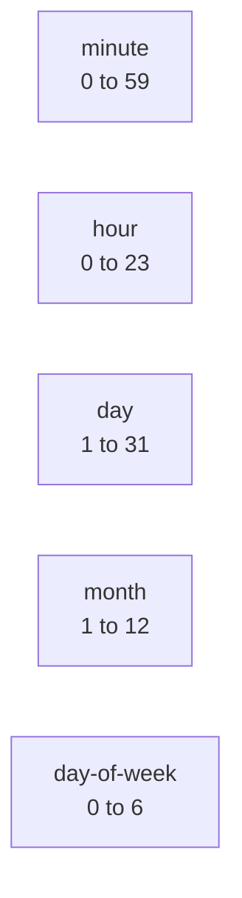

## The create flow

The Triggers page lists every configured trigger. The Create
button opens a modal that picks the kind first and then collects
kind-specific config.

```mockup:trigger-create
{ "kind": "cron" }
```

Cron triggers take a five-field UTC expression. The form shows a
human-readable preview ('Fires at 05:00 UTC weekdays') under the
field so you catch off-by-one timezone mistakes before saving.

Webhook triggers auto-generate a secret on save. The trigger
detail page shows the inbound POST URL and the secret for the
operator to copy.

```mockup:trigger-create
{ "kind": "webhook" }
```

Channel-pattern triggers match against inbound channel messages.
The regex is evaluated server-side; matches fire the trigger.

```mockup:trigger-create
{ "kind": "channel-pattern" }
```

## The cron expression layout

Cron expressions are five whitespace-separated fields, all in
UTC, with a one-minute minimum granularity.



Standard cron syntax: `*` for every value, `*/N` for every Nth,
`1,3,5` for explicit lists, `1-5` for ranges. UTC, always.

## REST + Python

```code-tabs:python,curl
--- python
trig = client.triggers.create(
    name="weekday-summary",
    kind="cron",
    cron_expression="0 5 * * 1-5",
    subscription_target="start_session",
    subscription_target_id="weekly-digest",
)
print(trig.id)
--- curl
curl -X POST https://primer.example/v1/triggers \
  -H "Authorization: Bearer $TOKEN" \
  -d '{
    "name":"weekday-summary",
    "kind":"cron",
    "cron_expression":"0 5 * * 1-5",
    "subscription_target":"start_session",
    "subscription_target_id":"weekly-digest"
  }'
```

## Run history

The trigger detail page lists every fire with timestamp, outcome
(success / error / suppressed), and a link to the session that
ran (when applicable). Use it to verify the cron expression is
firing on the schedule you expect before relying on it for
production work.

## Where to next

```ref:concepts/triggers-and-subscriptions
The concept page covers the trigger / subscription split in
detail.
```
