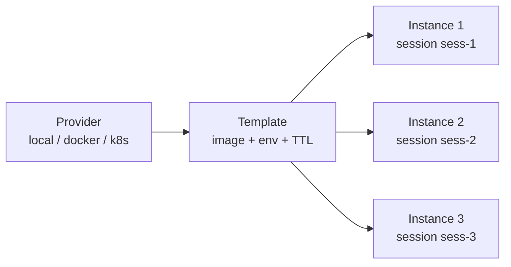

## Three pages, three jobs

The Workspaces area in the console splits into three pages, one
per concept layer:

- **Providers**: the backend bindings (local, docker, kubernetes).
- **Templates**: parameterised recipes that the provider knows
  how to instantiate.
- **Workspaces** (instances): live runtimes, one per session or
  per session-cluster.

```ref:concepts/workspaces
The concept page explains why the three levels exist; this page
is the operator walkthrough for each.
```

## The empty state

A fresh install has at least the `local` provider seeded, but no
templates and no instances. The workspaces page surfaces this:

```mockup:workspace-empty
{ "providerName": "local" }
```

## Creating a template

A template is a JSON-ish recipe: base image, env vars, TTL, and
the post-create command. The console template editor wraps this
in a form:

```mockup:workspace-template-form
{ "templateName": "python-3.13-default", "providerKind": "local", "baseImage": "python:3.13-slim" }
```

Hit Create template. The row appears on the templates list; the
provider validates that the recipe is reachable (the image
exists, the env-var shape is valid) but does not spin up an
instance yet.

## REST + Python

The same recipe creation via the API:

```code-tabs:python,curl
--- python
template = client.workspaces.create_template(
    provider_id="local",
    name="python-3.13-default",
    base_image="python:3.13-slim",
    ttl_minutes=30,
    env={"PYTHONUNBUFFERED": "1"},
)
--- curl
curl -X POST https://primer.example/v1/workspaces/templates \
  -H "Authorization: Bearer $TOKEN" \
  -d '{
    "provider_id":"local",
    "name":"python-3.13-default",
    "base_image":"python:3.13-slim",
    "ttl_minutes":30,
    "env":{"PYTHONUNBUFFERED":"1"}
  }'
```

Creating an instance from a template:

```code-tabs:python,curl
--- python
ws = client.workspaces.create(template_id="python-3.13-default")
print(ws.id, ws.status)
--- curl
curl -X POST https://primer.example/v1/workspaces \
  -H "Authorization: Bearer $TOKEN" \
  -d '{"template_id":"python-3.13-default"}'
```

## Provider, template, instance flow

The dependency chain is one-way: providers configure backends,
templates parameterise providers, instances are spun up from
templates.



A change to a provider or a template does not retroactively
mutate existing instances; they keep the recipe they were
created from. To pick up a template change, spin up a new
instance.

## Tuning the probe interval

The probe loop pings each running instance every
`workspace_probe_interval_seconds` (default 30 seconds). Three
consecutive misses flip the instance to `failed`. Tune the
interval down for fast detection (small clusters, dev) or up to
reduce probe overhead (large clusters, prod).

```callout:warning
Bumping the probe interval above the TTL of a quick session
defeats the point: the instance can be stopped via TTL before
the next probe runs. Keep `probe_interval < ttl_minutes / 4` as
a rule of thumb.
```
