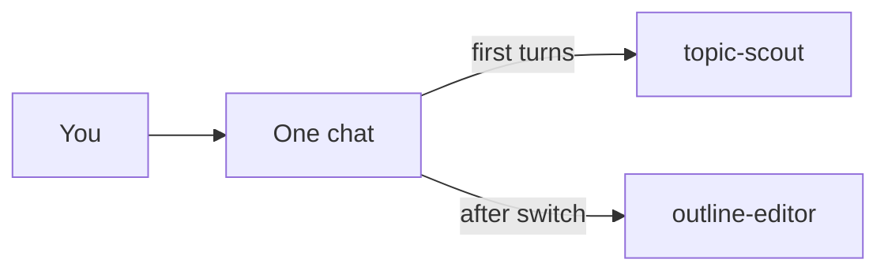
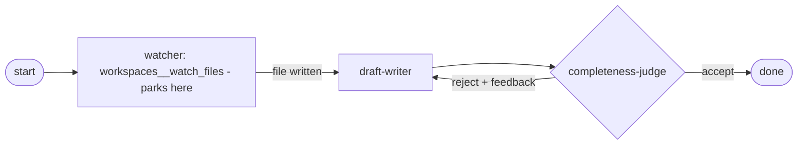

In this guide you will build a small "blog content assistant" from scratch using primer. Everything runs from the console against a free LLM key, and each step builds directly on the last -- by the end you will have two agents, a shared chat, a semantic router, a workspace file, and a graph that watches for that file and then drafts and reviews a blog post.

## Step 0 - Install and start

Clone the repo, sync dependencies, and start the API server. Then open the console at http://localhost:8000/console/.

```code-tabs:bash
--- bash
git clone https://github.com/codemug/primer.git
cd primer
uv sync
uv run primer api
```

```callout:info
This is the git-based install for now. Released-artifact installation is coming; until then, clone and run from source.
```

## Step 1 - Add an LLM provider (OpenRouter)

Get a free API key at openrouter.ai. In the console, go to Providers, then LLM, then Add provider. Choose provider type "openrouter" and paste your key -- the base URL is already filled in, so you only need the key. Once saved, enable a free model such as `meta-llama/llama-3.1-8b-instruct:free` from the models list.

```embed:llm-provider-openrouter
```

```ref:reference/api-providers
Provider types, config fields, and model discovery.
```

## Step 2 - Create two agents

You will create two lightweight agents for this guide.

- **topic-scout** -- given a broad theme, brainstorms five blog topics. No tools needed.
- **outline-editor** -- takes one chosen topic and turns it into a structured outline with sections and bullet points.

For each agent, open Agents, click New agent, fill the Basic tab (name, description, LLM provider, model) and the Advanced tab (system prompt), then save.

```embed:quickstart-agents
```

```ref:features/agents
Every field in the agent create modal.
```

## Step 3 - Chat, and switch agents mid-conversation

Open Chats and start a new chat with **topic-scout**. Ask it for five blog topics on a theme you like, for example "our product launch". Once you see the suggestions, use the agent switcher in the chat composer to switch the same chat to **outline-editor**, then continue the conversation by asking it to outline topic 3.

The key idea: both agents share the same conversation history. outline-editor can see the topics topic-scout produced, and you did not have to copy anything between windows.

```embed:chat-agent-switch
```



```ref:features/chats
Turn mechanics, the agent switcher, and streaming.
```

## Step 4 - Enable internal collections and a search-and-invoke agent

**Part A: enable the collections.** Go to Internal Collections and click Configure. Choose the bundled local embedder and the pre-configured `lance` semantic search provider -- it is local and file-based, so it needs no API key. After saving, the subsystem is in the configured state; click Bootstrap now to index primer's own agents, graphs, tools, and knowledge collections. The subsystem becomes active once bootstrapping completes.

```embed:internal-collections-enable
```

**Part B: create a router agent.** Create a new agent called **content-router**. Give it the tools `search__search_agents` and `system__invoke_agent`, and a system prompt along the lines of: "Search the agents collection for the best agent for the user's request, then invoke that agent with the task." (`search__search_agents` finds the agent; `system__invoke_agent` runs it.)

Now open a new chat with content-router and ask: "Find an agent that can outline a blog post and run it on the topic you pick." The agent searches the internal collection, finds outline-editor by description, and calls it -- all without you naming it explicitly.

```callout:tip
This is the dogfooding pattern: an agent that finds and runs other agents, with the full catalog kept out of its context behind semantic search.
```

```ref:features/internal-collections
The internal collections and the search toolset.
```

## Step 5 - Create a workspace and write a file

Go to Workspaces and create a new workspace using the default local provider. Give it a name like "blog-assistant".

Next, create a small **brief-writer** agent and give it the tool `workspaces__write_workspace_file`. Start a workspace session bound to that agent and the workspace you just created. Because this is a fresh session with a different agent, it does not share the Step 3 chat history -- paste the outline text produced in Step 3 directly into the session's instructions so brief-writer has the content it needs. Then instruct the agent to write that outline into a file called `outline.md` in the workspace.

```embed:workspaces
```

```embed:session-detail
```

```ref:features/workspaces
Workspace providers, templates, and the file tools.
```

## Step 6 - Build and run a graph (watch, draft, judge)

Now tie everything together with a graph. First, create three small agents for the graph nodes: **outline-watcher** (with the `workspaces__watch_files` tool), **draft-writer**, and **completeness-judge** -- or reuse existing ones if you already have them.

Create a new graph with these nodes:

- **start** -- the entry point.
- **watcher** -- an agent node with the `workspaces__watch_files` tool; its system prompt tells it to wait until `outline.md` appears in the workspace.
- **draft-writer** -- an agent node that reads the outline and writes a full blog draft.
- **completeness-judge** -- an agent node with a `response_format` that returns `accept` or `reject` plus brief feedback.
- **done** -- the end node that renders the finished draft.

Wire the edges: start to watcher, watcher to draft-writer, draft-writer to judge. Add a conditional router on the judge: `reject` loops back to draft-writer (set `max_iterations` to cap the loop), and `accept` continues to done.

**How the park-resume works.** When the watcher node calls `workspaces__watch_files`, the graph suspends (parks) instead of holding an open connection. The run stays parked until the file-change event fires. Writing `outline.md` in your workspace (Step 5 does exactly this) wakes the graph, and the producer-judge loop then runs to completion on its own.

```embed:quickstart-graph
```



```ref:features/graphs
Node and edge kinds, routers, and fan-out.
```

```ref:features/yielding-tools
Why a tool call can suspend a run and how it resumes.
```

```callout:warning
The Step 6 graph parks on a real file watch to show how a run suspends and resumes. If you would rather not wait, write outline.md first, then run the graph.
```

## Where to next

You have seen all the major building blocks: an LLM provider, two agents, a shared chat with an agent switch, a semantic router backed by internal collections, a workspace session that writes a file, and a graph with a park-resume loop. The guides below go deeper on each piece.

```ref:features/agents
How an agent turn actually runs and every configuration field.
```

```ref:features/harnesses
Package your tuned agents and graphs into a shareable, git-backed bundle.
```

```ref:cookbook/multi-agent-graph-research
A larger multi-agent graph worked end to end.
```
